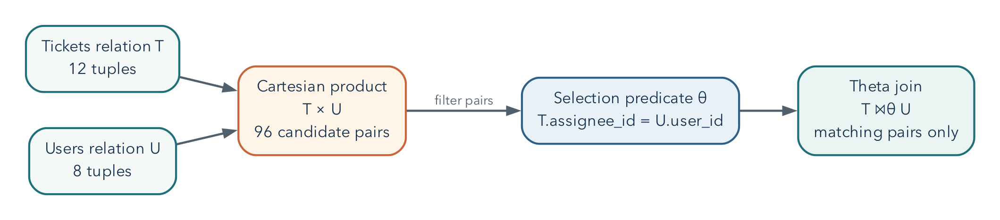

# Relational Operations Become Testable SQL

## Operating Question

How can a query answer a real question while making it possible to check whether
the answer is trustworthy?

A database can execute exactly the query we wrote while answering a different
question from the one we intended. This is common when SQL has become a collection
of remembered keywords rather than a model of how rows combine. We will rebuild
that model, starting with a few visible facts and ending with queries whose
behavior we can explain before and after execution. The aim is not speed at
typing SQL. It is being able to find a mistake that the SQL parser cannot find.

## Learning Outcomes

After this module, you can:

- explain rows, columns, keys, and relationships in a relational model;
- translate selection, projection, rename, product, join, union, and difference
  between relational-algebra notation and plain language;
- use `SELECT`, `WHERE`, `ORDER BY`, `JOIN`, `GROUP BY`, and aggregate functions;
- review subqueries, common table expressions, and safe `INSERT`, `UPDATE`, and
  `DELETE` patterns;
- reason about `NULL` without treating it as zero or an empty string;
- distinguish the written order of a query from its logical processing order; and
- verify a query with counts, boundary cases, and comparison queries.

## A Relation Represents One Kind of Fact

### The Instance Used in This Chapter

The worked SQL uses the complete Metro Support baseline: **8 users, 12 tickets,
and 21 ticket events**. Load the supplied schema and seed script into an isolated
PostgreSQL practice database. A new web-editor tab may use a new database session,
so the examples use names such as `metro_support.tickets` rather than relying on
an earlier `SET search_path` command.

The SQL review notebook starts with a smaller 4-user/6-ticket/9-event instance to
make the first demonstrations easy to inspect. Its final **Complete Week 2 Lab
Dataset** section switches to the full baseline used here and in both labs. A
different instance can produce different answers to the same correct query.
Always identify which data you are reasoning about before comparing counts.

The relational model organizes data into relations commonly presented as tables.
A row represents one occurrence, and each column represents one attribute of that
kind of occurrence. A key identifies a row. A foreign key records a relationship
by referring to a key in another table.

Metro Support separates:

- `users`: one row per person or staff account;
- `tickets`: one row per support request; and
- `ticket_events`: one row per recorded event in a ticket's history.

This separation avoids repeating a user's name and email in every ticket event.
It also creates work: a query must join related rows when the answer needs facts
from more than one table.

### Schema, Instance, Domain, and Key

A *schema* describes the structure: for example, tickets have an identifier,
requester, status, and opening time. An *instance* is the collection of rows that
exists at a particular moment. The instance changes when a ticket arrives; the
schema usually does not. Mixing up the two leads to rules that happen to fit
today's data but do not describe tomorrow's valid data.

A *domain* describes the permitted kind of value for an attribute. Some domain
information comes from a type such as integer or timestamp, and some comes from
a rule such as the set of allowed statuses. A ticket identifier and an agent
identifier may both use integers without meaning the same thing. Their names,
keys, and relationships give them different roles.

A key is not simply a convenient-looking column. It must distinguish permitted
rows. A person's current display name is a poor identifier if two people can
share it or one person can change it. An assigned `user_id` allows relationships
to remain stable through a name change. Chapter 3 will separate the mathematical
idea of a candidate key from the particular key chosen as the SQL primary key.

## Relational Algebra Gives Us a Reasoning Vocabulary

Relational algebra describes how one or more input relations become an output
relation. The notation is less important than the habit of decomposing a question
into operations.

Assume $T$ is the tickets relation and $U$ is the users relation. Let $\varphi$
and $\theta$ stand for predicates: expressions that evaluate to true or false for
a tuple or tuple pair.

| Operation | Conventional notation | Plain-language job |
|---|---|---|
| selection | $\sigma_{\varphi}(T)$ | keep tuples from $T$ that satisfy predicate $\varphi$ |
| projection | $\pi_{a_1,\ldots,a_k}(T)$ | keep attributes $a_1$ through $a_k$ |
| rename | $\rho_{S}(T)$ | give relation $T$ the name $S$ |
| Cartesian product | $T \times U$ | pair every tuple in $T$ with every tuple in $U$ |
| theta join | $T \bowtie_{\theta} U$ | pair tuples that satisfy relationship predicate $\theta$ |
| union | $R \cup S$ | include tuples that occur in either compatible relation |
| intersection | $R \cap S$ | include tuples that occur in both compatible relations |
| difference | $R - S$ | include tuples in $R$ but not in compatible relation $S$ |

The subscripts carry the details of an operation. In $\sigma_{\varphi}(T)$,
$\varphi$ is the row condition. In $\pi_{a_1,\ldots,a_k}(T)$, the subscript is the
attribute list. The letters $R$, $S$, $T$, and $U$ name relations; they are not SQL
keywords.

Classical projection selects attributes. SQL's expression list can also compute
new values, which is often called generalized projection. Likewise, grouping and
outer joins are useful extensions beyond the small classical algebra listed
here. Knowing the boundary prevents us from forcing every SQL feature into a
notation that was introduced for a simpler mathematical model.

| Relational idea | Common SQL expression |
|---|---|
| selection | `WHERE` |
| projection | the expression list after `SELECT` |
| rename | `AS` |
| Cartesian product | `CROSS JOIN` |
| theta/equi-join | `JOIN ... ON` |
| union | `UNION` |
| intersection | `INTERSECT` |
| difference | `EXCEPT` |

Union, intersection, and difference require *union-compatible* inputs: the same
number of attributes with corresponding domains that can be compared. SQL adds
practical details such as column names, data-type conversion, duplicate handling,
and `NULL` semantics.

A theta join can be understood as a selection applied to a Cartesian product:

$$
T \bowtie_{\theta} U = \sigma_{\theta}(T \times U)
$$

This identity explains why a missing join predicate is dangerous. Without
$\theta$, the system retains the full product rather than only meaningful pairs.

{#fig-relational-join width=96%}

### Example Translation

**Question:** Which high-priority tickets are still active, and what are their
subjects?

Reasoning:

1. select tickets where priority is high and status is active;
2. project the ticket identifier, subject, and status; and
3. sort for presentation, which is useful SQL behavior but not a core relational-
   algebra operation.

Let $A$ be the set of active status values:

$$
A = \{\text{'new'},\ \text{'open'},\ \text{'in\_progress'}\}.
$$

Define the predicate $\varphi$ and then apply selection followed by projection:

$$
\varphi = (\text{priority}=\text{'high'})
\land (\text{status}\in A)
$$

$$
Q =
\pi_{\text{ticket\_id},\,\text{subject},\,\text{status}}
\left(\sigma_{\varphi}(\text{tickets})\right)
$$

```sql
SELECT ticket_id, subject, status
FROM metro_support.tickets
WHERE priority = 'high'
  AND status IN ('new', 'open', 'in_progress')
ORDER BY ticket_id;
```

### Algebra and SQL Are Related, Not Identical

In the full baseline, the query above returns ticket IDs **1001 and 1011**.
Ticket 1003 is urgent but already resolved, so it does not belong. Ticket 1005 is
high priority but resolved, so it does not belong either. The excluded examples
are as important as the included ones: they test that both parts of the question
have survived the translation.

Classical relational algebra uses sets: duplicate tuples do not occur, and
ordering is not part of a relation. SQL normally uses *bag* or multiset semantics,
so duplicate result rows can occur unless a key, grouping operation, `DISTINCT`,
or set operator changes that. SQL also includes `NULL` and three-valued logic,
which require reasoning beyond classical algebra.

This difference explains two important habits: always state the expected result
grain, and never assume row order without `ORDER BY`.

## Start With a Precise Question

"Show tickets" is vague. "List open or in-progress high-priority tickets, newest
first, with the assigned agent's name" is testable. It identifies:

- the unit: one ticket per result row;
- the filter: selected statuses and high priority;
- the order: newest first;
- the relationship: ticket to assigned user; and
- the desired attributes.

Before writing SQL, state the expected grain: what does one result row mean?
Unexpected duplicates often reveal that the query changed grain.

## Select, Filter, and Sort

```sql
SELECT ticket_id, subject, status, opened_at
FROM metro_support.tickets
WHERE status IN ('open', 'in_progress')
ORDER BY opened_at DESC;
```

`SELECT` names the output expressions. `FROM` identifies the source. `WHERE`
removes rows that do not meet the predicate. `ORDER BY` controls presentation.
Without `ORDER BY`, row order is not guaranteed, even when repeated runs appear
consistent.

When two tickets share an opening time, that one-column sort does not determine
their relative order. Add `ticket_id` as a tie-breaker if repeatable ordering
matters: `ORDER BY opened_at DESC, ticket_id`. A stable order is particularly
important when an application retrieves one page at a time.

### Parentheses Preserve the Question

Suppose the question changes to active tickets with **high or urgent** priority.
Write the two priority alternatives together:

```sql
SELECT ticket_id, priority, status
FROM metro_support.tickets
WHERE priority IN ('high', 'urgent')
  AND status IN ('new', 'open', 'in_progress')
ORDER BY ticket_id;
```

Without the grouping, `priority = 'high' OR priority = 'urgent' AND ...` means
high priority *regardless of status*, or urgent priority with the additional
status condition. SQL evaluates `AND` more tightly than `OR`. On the baseline,
that mistake admits resolved high-priority tickets 1005 and 1008. The statement
is legal SQL; the error is in the logical claim we encoded.

Use parentheses even when you know the precedence rule if they make that claim
easier for the next reader to see. Choosing a compact expression is useful only
when it preserves both meaning and readability.

Avoid `SELECT *` in durable work. Explicit columns document intent, reduce
unnecessary transfer, and make a query less vulnerable to later schema changes.

## SQL's Logical Order

SQL is written in a human-readable order but reasoned about approximately as:

1. `FROM` and `JOIN` build the source rows.
2. `WHERE` filters individual rows.
3. `GROUP BY` forms groups.
4. aggregate calculations summarize each group.
5. `HAVING` filters groups.
6. `SELECT` produces output expressions.
7. `DISTINCT`, if requested, removes duplicate output rows.
8. `ORDER BY` sorts the result.
9. `LIMIT` restricts the returned rows.

This explains why a `SELECT` alias is often unavailable in `WHERE`: the filter is
logically evaluated before the output alias exists.

This is a reasoning order, not a literal instruction to the storage engine to
build every intermediate table. An optimizer may push a safe filter earlier,
choose a different join algorithm, or avoid sorting by reading an index in order.
Those choices must preserve the query's semantics. Chapters 7 and 11 return to
this distinction between the question and its physical execution.

## Join Related Facts

```sql
SELECT
    t.ticket_id,
    t.subject,
    u.display_name AS assignee_name
FROM metro_support.tickets AS t
LEFT JOIN metro_support.users AS u
    ON u.user_id = t.assignee_id
ORDER BY t.ticket_id;
```

An `INNER JOIN` returns only matching pairs. A `LEFT JOIN` preserves every row
from the left side and supplies `NULL` for missing right-side values. Because two
tickets are unassigned, an inner join would silently remove them. The join type is
therefore a statement about the question, not just syntax.

### A Join Is a Filtered Product

A Cartesian product pairs every row in one relation with every row in another.
With 12 tickets and 8 users, the product has 96 pairs. An equi-join keeps only
pairs whose key values match. Thinking of a join as product plus selection makes a
missing join condition easier to recognize.

Formally, if $|T|$ denotes the number of tuples in $T$, then:

$$
|T \times U| = |T|\,|U|.
$$

For the class data, $|T|=12$ and $|U|=8$, so $|T \times U|=96$. A selective join
predicate should discard most of those candidate pairs.

### Diagnose Duplicate Rows

Joining one ticket to many events changes the grain from one row per ticket to one
row per matching event:

```sql
SELECT t.ticket_id, t.subject, e.event_type, e.event_at
FROM metro_support.tickets AS t
JOIN metro_support.ticket_events AS e
    ON e.ticket_id = t.ticket_id
WHERE t.ticket_id = 1003
ORDER BY e.event_at;
```

Three rows for ticket 1003 are correct because it has three events. The repeated
ticket identifier refers to distinct events, not three separate tickets.

`DISTINCT` removes only rows identical across the selected
expressions. If event type or time differs, those three rows remain distinct.
If we project only the ticket ID, `DISTINCT` can deliberately answer "which
tickets had a matching event?" But it does not turn an event-level sum into a
ticket-level sum. We must choose the unit of analysis before choosing the
aggregate, especially when the result could influence workload or service
decisions.

## `NULL` Means Missing or Inapplicable

`NULL` is not zero, blank text, or a normal value. Ordinary equality comparisons
with `NULL` produce unknown rather than true. In a `SELECT` query, compare these
two filter clauses:

```sql
-- Incorrect: this does not find unassigned tickets.
WHERE assignee_id = NULL

-- Correct.
WHERE assignee_id IS NULL
```

Three-valued logic includes true, false, and unknown. This matters for filters,
constraints, joins, and aggregates. `count(*)` counts rows. `count(assignee_id)`
counts only rows where that expression is not null.

The essential truth table for `AND` is:

| $p$ | $q$ | $p \land q$ |
|---|---|---|
| `TRUE` | `TRUE` | `TRUE` |
| `TRUE` | `UNKNOWN` | `UNKNOWN` |
| `FALSE` | `UNKNOWN` | `FALSE` |
| `UNKNOWN` | `UNKNOWN` | `UNKNOWN` |

A `WHERE` clause keeps only rows for which its predicate is
`TRUE`. Both `FALSE` and `UNKNOWN` are filtered out.

### Why `NOT IN` Can Surprise You

The assigned-agent column contains nulls. Consequently, asking for users whose
ID is `NOT IN (SELECT assignee_id FROM metro_support.tickets)` is not the same
as asking whether no ticket has that user's ID. A comparison against the null
member is unknown, and negating unknown does not make it true. This can eliminate
every otherwise unmatched user from the result.

An existence test states the intended question more directly:

```sql
SELECT u.user_id, u.display_name
FROM metro_support.users AS u
WHERE NOT EXISTS (
    SELECT 1
    FROM metro_support.tickets AS t
    WHERE t.assignee_id = u.user_id
)
ORDER BY u.user_id;
```

For each candidate user, the inner query asks whether a matching assignment
exists. The selected constant `1` has no business meaning; `EXISTS` cares whether
there is a row. Null assignments simply do not match an ordinary user ID. This
query includes residents and other non-agent accounts because it asks about
**all users**. Add a role condition only if the intended population is narrower.

## Group and Aggregate

```sql
SELECT
    category,
    count(*) AS ticket_count,
    count(closed_at) AS closed_timestamp_count
FROM metro_support.tickets
GROUP BY category
ORDER BY ticket_count DESC, category;
```

After grouping, every selected expression must either identify the group or
summarize it. The result grain is now one row per category.

Use `HAVING` for a condition on a group:

```sql
SELECT category, count(*) AS ticket_count
FROM metro_support.tickets
GROUP BY category
HAVING count(*) >= 3;
```

## Worked Example: Staff Workload Including Zero Counts

**Question:** For every agent or supervisor, how many active tickets are assigned?

First define "active" as `new`, `open`, or `in_progress`. The result should have
one row per staff member in those two roles, including supervisor Elena Garcia,
who currently has none. Analysts and residents are outside this report's stated
population. This explicit definition matters: the baseline's two agents both
have active work, so an agents-only example would not show the zero-count case.

```sql
SELECT
    u.user_id,
    u.display_name,
    count(t.ticket_id) AS active_ticket_count
FROM metro_support.users AS u
LEFT JOIN metro_support.tickets AS t
    ON t.assignee_id = u.user_id
   AND t.status IN ('new', 'open', 'in_progress')
WHERE u.role IN ('agent', 'supervisor')
GROUP BY u.user_id, u.display_name
ORDER BY active_ticket_count DESC, u.display_name;
```

Why is the ticket-status condition in `ON` rather than `WHERE`? A `WHERE`
condition on `t.status` would remove the null-extended row for an agent with no
matching active ticket, making the left join behave like an inner join for this
purpose.

Why `count(t.ticket_id)` instead of `count(*)`? The left join produces one row for
an agent with no match, but `t.ticket_id` is null in that row. Counting the ticket
identifier correctly yields zero.

The expected result is Priya Shah with 3, Noah Williams with 2, and Elena Garcia
with 0. Those counts sum to 5, while the baseline has 7 active tickets. The two
unassigned requests, 1004 and 1009, are not owned by any staff member and therefore
do not appear in this *staff* grouping. Nothing was lost from the database. A
complete operational dashboard could present the five assigned requests and a
separate two-request unassigned queue.

This is a useful limit on the phrase "preserves missing rows." A left join
preserves the chosen left population, not every record in every participating
table. In the earlier query, the left population was tickets. Here it is staff.
Changing which side we preserve changes the question.

## Subqueries and CTEs Name Intermediate Relations

A table subquery produces a result used as an input relation. A scalar subquery
produces one value and must not return multiple rows. An `EXISTS` subquery answers
a yes/no existence question. A common table expression, or CTE, gives an
intermediate result a name. These are related tools, not interchangeable syntax.

```sql
WITH active_tickets AS (
    SELECT ticket_id, assignee_id, priority
    FROM metro_support.tickets
    WHERE status IN ('new', 'open', 'in_progress')
),
agent_counts AS (
    SELECT assignee_id, count(*) AS active_count
    FROM active_tickets
    WHERE assignee_id IS NOT NULL
    GROUP BY assignee_id
)
SELECT u.display_name, a.active_count
FROM agent_counts AS a
JOIN metro_support.users AS u
    ON u.user_id = a.assignee_id
ORDER BY a.active_count DESC, u.display_name;
```

Read each CTE as a named step in relational reasoning. A CTE can improve clarity,
but it is not automatically faster. PostgreSQL's optimizer and version determine
how it is planned.

The CTE example above starts from assigned active tickets. It therefore returns
Priya and Noah, but not Elena. That is intentional for this particular query;
it is not equivalent to the preceding all-staff report. To include zero-workload
staff, start with the staff relation and left join the CTE counts, using
`COALESCE(active_count, 0)` for an absent group. Naming an intermediate result
improves readability, but it does not excuse checking who is included.

Set operators express union and difference when inputs have compatible columns:

```sql
-- Users who requested a ticket but are not assigned to any ticket.
SELECT requester_id AS user_id
FROM metro_support.tickets
EXCEPT
SELECT assignee_id
FROM metro_support.tickets
WHERE assignee_id IS NOT NULL;
```

`UNION` removes duplicate rows. `UNION ALL` preserves them and avoids duplicate-
elimination work when set semantics are not required.

## Review Safe Data Changes

Queries read state; data-manipulation statements change it.

Use the following insertion as a rehearsal. The transaction rolls back the new
event, so rerunning the example does not accumulate records or collide with the
same event key. Begin from the baseline, where event 5099 is unused.

```sql
BEGIN;
INSERT INTO metro_support.ticket_events (
    event_id, ticket_id, actor_id, event_type, old_status, new_status, note, event_at
) VALUES (
    5099, 1001, 201, 'note_added', 'open', 'open',
    'Replacement lamp requested', now()
)
RETURNING event_id, ticket_id, event_type;
ROLLBACK;
```

Before an `UPDATE` or `DELETE`, write the same predicate as a `SELECT` and inspect
the target keys:

```sql
SELECT ticket_id, priority
FROM metro_support.tickets
WHERE category = 'streetlight'
  AND priority = 'medium';

BEGIN;

UPDATE metro_support.tickets
SET priority = 'high'
WHERE category = 'streetlight'
  AND priority = 'medium'
RETURNING ticket_id, priority;

ROLLBACK;
```

`RETURNING` shows affected rows. A transaction creates a decision point. Neither
replaces a correct predicate or independent verification.

Use the same discipline for deletion:

This deletion example is a predicate-and-transaction template. If you just ran
the rolled-back insertion above, event 5099 does not exist, so it correctly
deletes zero rows. To observe one deletion, create that disposable event inside
this same transaction before the `DELETE`. Never change the predicate to a
broad one merely to make the affected-row count nonzero.

```sql
BEGIN;

DELETE FROM metro_support.ticket_events
WHERE event_id = 5099
RETURNING event_id, ticket_id;

-- Verify the intended row and then choose COMMIT or ROLLBACK.
ROLLBACK;
```

Never practice broad destructive statements in a shared or production database.

## Verification Is a Second Query or Reasoning Path

Use at least one of these methods:

- **Known total:** compare grouped counts with the total number of source rows.
- **Boundary case:** inspect an unassigned ticket, a null value, or a user with no
  match.
- **Simpler query:** verify one result category with a direct filtered count.
- **Uniqueness check:** compare total rows with distinct keys at the expected grain.
- **Manual sample:** trace one identifier across source tables.

For the workload query, verify Priya Shah directly:

```sql
SELECT ticket_id, status
FROM metro_support.tickets
WHERE assignee_id = 201
  AND status IN ('new', 'open', 'in_progress');
```

The verification query is intentionally less abstract. Independent reasoning is
more valuable than repeating the same logic in a different format.

## Common Misconceptions

### "No rows means the query worked"

No rows could mean no data matches, the filter is wrong, a join removed records,
or the setup failed. Verify source counts and test one known identifier.

### "A join connects tables automatically"

SQL joins use the condition you write. A missing or incorrect condition can create
a Cartesian product or pair unrelated records.

### "`DISTINCT` fixes duplicates"

`DISTINCT` removes identical output rows. It does not fix an incorrect grain or
relationship and may hide a modeling or join error.

## Practice

For the assigned individual work, follow the Week 2 page. The first lab applies
the filters and null reasoning to three questions. The second repairs a dashboard,
counts staff workload, and rehearses an update. The additional exercise below is
study or extension practice, not another required submission.

First express the required operations in plain language or relational-algebra
notation. Then write a query that returns one row per neighborhood with:

- the number of resident users;
- the number of tickets they requested; and
- the most recent ticket opening time.

Before running it, predict which joins are required and whether a left join is
necessary. After running it, verify one neighborhood with a simpler query.

## Retrieval and Transfer

1. How do selection and projection differ?
2. Why is a join related to a Cartesian product?
3. What does one row in a query result represent?
4. Why can a left join return more rows than the left table?
5. What is the difference between `WHERE` and `HAVING`?
6. Why does `column = NULL` not work as expected?
7. When does `UNION ALL` express the intended result better than `UNION`?
8. What should you do before running an `UPDATE` or `DELETE`?
9. A report suddenly doubles its row count after an events table is joined. What
   should you inspect before adding `DISTINCT`?

## Further Reading

- [PostgreSQL `SELECT`](https://www.postgresql.org/docs/current/sql-select.html)
- [PostgreSQL table expressions and joins](https://www.postgresql.org/docs/current/queries-table-expressions.html)
- [PostgreSQL aggregate functions](https://www.postgresql.org/docs/current/functions-aggregate.html)
- [*Database Design - 2nd Edition*, Chapter 8](https://opentextbc.ca/dbdesign01/chapter/chapter-8-entity-relationship-model/)
