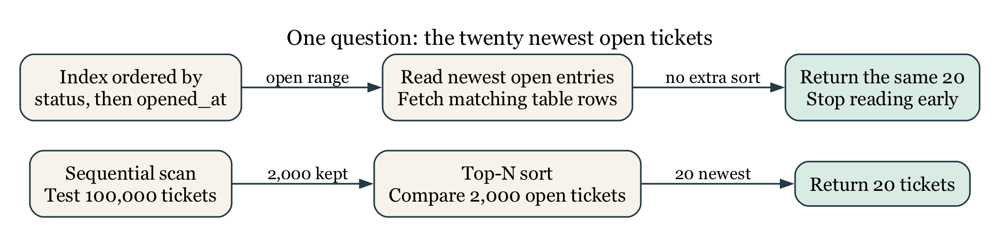

# Performance Work Begins With Measurement

## Operating Question

When a query feels slow, what observations can distinguish a scan, a bad estimate, an
expensive join, an avoidable sort, blocking, or simply more work than expected?

## Learning Outcomes

After this module, you can:

- turn a vague complaint into a reproducible query and workload statement;
- distinguish estimated plans from plans with actual execution measurements;
- recognize common scan, join, sort, and aggregate plan nodes;
- connect selectivity and statistics to planner choices;
- design and test a basic single-column, composite, or partial index; and
- decide whether an improvement justifies its write, storage, and maintenance cost.

## "Slow" Is a Symptom, Not a Diagnosis

Begin with a reproducible statement:

- Which exact query and parameter values?
- Which database, schema, and data volume?
- What result grain and row count?
- What elapsed time or service objective?
- Is the time spent executing, waiting for a lock, transferring many rows, or
  rendering in a client?
- Is the behavior repeatable, and what changed?

A query returning a million rows may be fast for the database and slow for the
network or browser. A query waiting on a lock may have a simple plan. Measure the
right layer.

The repair desk wants its twenty newest open requests, not a faster version of a
different answer. That distinction defines the experiment: keep the query's
meaning and data fixed, then change how the DBMS can find the rows. The small
twelve-ticket fixture is useful for checking the answer. The separate
[Week 7 performance fixture](../weeks/week_07/performance_lab_setup.sql) supplies
100,000 synthetic rows, including 2,000 open tickets, to make differences in
search work visible. It is a teaching workload, not a benchmark of city services
or a cloud vendor.

## SQL Describes an Answer; a Plan Describes Work

Chapter 2 used relational algebra to explain what a query means. A physical plan
chooses algorithms and access paths that produce that answer. A join could
compare rows repeatedly, probe an index, build a hash table, or merge ordered
inputs. The correct result should not depend on which suitable algorithm wins.
This separation is part of data independence: an administrator can add an index
without requiring every application to rewrite its question.

Cost-based optimization compares estimated alternatives rather than applying
"always use an index." The classic System R work by Selinger and colleagues
described access-path selection for relational queries in 1979. Its relevance
here is the separation of a declarative request from the physical strategy that
executes it, not a claim that a modern PostgreSQL plan is identical to System R.
[IBM's research record](https://research.ibm.com/publications/access-path-selection-in-a-relational-database-management-system)

## `EXPLAIN` Shows the Planner's Strategy

```sql
EXPLAIN
SELECT ticket_id, subject, opened_at
FROM metro_support.tickets
WHERE status = 'open'
ORDER BY opened_at DESC;
```

Plain `EXPLAIN` estimates a plan without executing the planned statement. Use
trusted course SQL: planning can still require locks and evaluate eligible
constant expressions, so it is not a general sandbox for arbitrary code.

```sql
EXPLAIN (ANALYZE, BUFFERS)
SELECT ticket_id, subject, opened_at
FROM metro_support.tickets
WHERE status = 'open'
ORDER BY opened_at DESC;
```

`ANALYZE` executes the statement and reports actual timing and rows. On `UPDATE`,
`DELETE`, or function calls, that means real side effects unless protected and
rolled back. Use it only when execution is safe. `BUFFERS` reports cache and I/O
activity available to the statement.

A transaction and rollback can undo ordinary transactional data changes made by
an analyzed write, but they do not make external side effects or sequence
allocation disappear. In this course, measure SELECT queries in disposable data.
Do not benchmark a production DELETE merely because its plan is interesting.

## Read a Plan From the Inside Out

A plan is a tree. Child nodes produce rows for parent nodes.

Common nodes include:

- **Seq Scan:** inspect table pages and test rows. Often correct for a small table
  or a query returning much of the table.
- **Index Scan:** use an index to find row locations, then access table rows.
- **Index Only Scan:** answer from index entries when required columns and
  visibility information permit it.
- **Bitmap Index/Heap Scan:** collect many index matches and visit table pages in
  batches.
- **Nested Loop:** for each row from one input, scan or probe the other input.
- **Hash Join:** build a hash table for one input and match the other, commonly for
  equality joins.
- **Merge Join:** consume sorted inputs and merge matching keys.
- **Sort:** order rows; may use memory or spill to temporary storage.
- **Aggregate/GroupAggregate/HashAggregate:** reduce input rows into summaries.

Node names are not grades. A sequential scan is not automatically bad, and an
index scan is not automatically good.

### Follow the Rows Through One Plan

The following excerpt comes from the course fixture on an isolated PostgreSQL 15
server during the September 7, 2026 audit. Timings and estimates will vary on
another run. The text is abbreviated to expose the rows and algorithm, not to
hide an unfavorable measurement.

```text
Limit (actual rows=20 loops=1)
  -> Sort (actual rows=20 loops=1)
       Sort Key: opened_at DESC
       Sort Method: top-N heapsort
       -> Seq Scan on tickets (actual rows=2000 loops=1)
            Filter: status = 'open'
            Rows Removed by Filter: 98000
```

The scan tests 100,000 rows, keeps 2,000, and rejects 98,000. The sort receives
2,000 candidates. A top-N sort can retain a small set of best candidates rather
than fully sort every row, but it still has to inspect the input to know which
are newest. The parent asks for twenty rows, so only twenty emerge at the top.
Seeing `rows=20` at the sort does not mean only twenty candidates were considered.

{#fig-query-plan-flow width=95%}

For a node repeated by a nested loop, actual rows and time are reported per loop
on average. A child with `rows=3 loops=100` produces about 300 rows across those
invocations, not three total. Parent time includes work in its children, so
adding every node's time double-counts work. Likewise, a shared buffer **hit**
means PostgreSQL found a page in its buffer cache; a **read** does not necessarily
mean the physical disk was accessed, because the operating system may cache it.
[PostgreSQL EXPLAIN guide](https://www.postgresql.org/docs/current/using-explain.html)

## Estimates Drive Choices

The planner estimates row counts and costs using table statistics, data type
information, constraints, and configurable assumptions. Compare estimated rows
with actual rows in an analyzed plan.

Large mismatches may come from:

- stale statistics;
- correlated columns that basic statistics treat as independent;
- unusual parameter values;
- skewed data;
- expressions without useful statistics; or
- a model that hides important relationships.

`ANALYZE` refreshes statistics:

```sql
ANALYZE metro_support.tickets;
```

Do not run maintenance blindly as a ritual. Identify the mismatch and verify the
effect.

The fixture's first scan estimated 2,017 open rows and produced 2,000. That is a
reasonable estimate, even though the plan still had to read the whole table.
After refreshing statistics, another estimate was 1,953. Sampling makes small
differences normal. A useful question is whether an error is large enough to
favor an unsuitable join or access path, not whether every estimate is exact.

The displayed `cost=startup..total` uses the planner's cost units, not
milliseconds. Startup cost estimates work before the first row; total cost
estimates work to produce the full node result. LIMIT can favor a path that
starts quickly and stops early even if that path's full-result cost is higher.

## Selectivity Explains Many Scan Decisions

Selectivity is the fraction of rows expected to satisfy a condition. An index is
often attractive when a query needs a small, identifiable fraction of a large
table. If nearly every row has `status = 'open'`, using an index may still require
visiting most table pages, making a sequential scan reasonable.

For predicate $\varphi$ over relation $R$, define selectivity as:

$$
s(\varphi)=
\frac{|\sigma_{\varphi}(R)|}{|R|},
\qquad 0\le s(\varphi)\le 1.
$$

A predicate matching 500 rows in a 1,000,000-row table has
$s(\varphi)=0.0005$, or $0.05\%$. Selectivity alone does not choose a plan, but it
helps explain why an index can be attractive for one predicate and wasteful for
another.

Here $|R|$ means the number of rows and $\sigma$ means selection, or keeping rows
that match the predicate. The ratio is defined for a nonempty relation; there is
no need to divide by zero for an empty table.

The twelve-row class dataset is too small to demonstrate realistic planner
tradeoffs. Performance labs create a larger, disposable table with a skewed status
distribution. Small examples teach correctness; larger fixtures reveal access
paths.

## B-Tree Indexes Support Ordered Comparisons

PostgreSQL's default B-tree index supports equality and range comparisons and can
also help ordered retrieval.

A B-tree is a balanced search structure organized into pages. At an internal
page, comparisons choose a smaller range of possible keys. Leaf entries lead to
matching table rows and support movement through neighboring ordered keys. The
tree stays relatively shallow because a page can direct searches to many child
pages. This is different from reading every ticket and testing its status.

For a simplified model with roughly $b$ children per internal page and $N$ keys,
the number of levels grows on the order of $\log_b N$, rather than $N$. The
notation says how growth behaves; it is not a prediction of milliseconds or an
exact PostgreSQL page count. Retrieving many matches still requires processing
those matches and possibly visiting many table pages.

```sql
CREATE INDEX perf_tickets_status_opened_idx
ON performance_lab.tickets (status, opened_at DESC);
```

A composite index is ordered first by `status`, then by `opened_at` within each
status. It may efficiently support this query fragment, which is not a standalone
SQL statement:

```sql
WHERE status = 'open'
ORDER BY opened_at DESC
LIMIT 20
```

It is less directly suited to a query that filters only `opened_at` without the
leading column. Column order should follow real predicates and ordering needs,
not a rule such as "most unique first" applied without context.

It is also not correct to say a later column can *never* help without the first.
Planner choices depend on the version and distribution; PostgreSQL 18 documents
B-tree skip-scan cases. The lab's core comparison does not depend on that feature.
[Multicolumn indexes](https://www.postgresql.org/docs/current/indexes-multicolumn.html)

An index containing `(status, opened_at)` does not also contain every subject
text. An ordinary index scan locates entries and fetches the table rows. A
covering index can include extra output columns, but larger entries cost space
and write work. Even an index-only scan may need table visits to establish row
visibility under MVCC. The node name is not a promise of zero heap fetches.
[Index-only scans](https://www.postgresql.org/docs/current/indexes-index-only-scans.html)

## Partial Indexes Cover a Deliberate Subset

If most tickets are closed but the operational queue reads only active rows, a
partial index may be smaller:

```sql
CREATE INDEX perf_tickets_active_opened_idx
ON performance_lab.tickets (opened_at DESC)
WHERE status IN ('new', 'open', 'in_progress');
```

The query predicate must imply the index predicate for the planner to use it.
Partial indexes add design specificity: if the application's definition of active
changes, the index and queries may need coordinated revision.

## Indexes Have Costs

Each useful index can add:

- storage;
- write work on inserts, updates, and deletes;
- write-ahead log volume;
- backup size or duration;
- cache competition; and
- maintenance and cognitive overhead.

Duplicate, unused, or speculative indexes are not free. Start with a defined
workload and baseline measurements.

Not every column update changes every index entry, and PostgreSQL can sometimes
use heap-only tuple optimizations when indexed values are unchanged and page
conditions permit. The beginner design question remains: does the benefit to the
important reads justify maintaining another data structure? A classroom read
test does not measure the cost of a busy production write workload.

## Worked Example: Test an Index Hypothesis

**Workload:** list the 20 newest open tickets in a large operational table.

Start with the linked disposable setup. The preceding index definitions are
examples to study, not extra indexes to leave installed before the baseline.
Running the setup resets only `performance_lab` and removes its earlier indexes.
The setup also refreshes table statistics. Measure the baseline twice before
creating an index, then avoid another statistics refresh between measurements.
This keeps the proposed access path as the deliberate change. Cache state and
background activity may still vary, so it is not a controlled hardware benchmark.

### Baseline

```sql
EXPLAIN (ANALYZE, BUFFERS)
SELECT ticket_id, subject, opened_at
FROM performance_lab.tickets
WHERE status = 'open'
ORDER BY opened_at DESC
LIMIT 20;
```

Record:

- scan node;
- estimated and actual rows at the scan;
- whether a sort occurs;
- planning and execution time; and
- buffer activity.

### Hypothesis

An index on `(status, opened_at DESC)` can locate open rows in requested order and
may avoid scanning and sorting unrelated rows.

### Add the Candidate

```sql
CREATE INDEX perf_tickets_status_opened_idx
ON performance_lab.tickets (status, opened_at DESC);
```

### Remeasure

Run the identical analyzed query twice. Do not change the selected columns, predicate,
order, or limit while comparing.

The corresponding audited plan was:

```text
Limit (actual rows=20 loops=1)
  -> Index Scan using perf_tickets_status_opened_idx on tickets
       (actual rows=20 loops=1)
       Index Cond: status = 'open'
```

The index supplies matching rows in opening-time order, so no separate sort is
needed and the parent stops after twenty. The earlier run recorded 1,191 shared
buffer hits; this indexed run recorded 11 hits and four reads. These are local
observations of this fixture, not a service-level guarantee. Confirm the same
twenty ticket IDs as well as the reduced work. A faster query returning different
requests is not an optimization of the original question.

### Decide

Keep the index only if the workload benefit is meaningful relative to its cost.
A changed node name alone is not enough. On a warm cache and small class fixture,
timing can vary; plan shape, rows, sort removal, and buffers may be more stable
indicators.

## Separate Query Tuning From Lock Diagnosis

An analyzed plan reports execution after the statement can proceed. If the query
waits on another transaction, `pg_stat_activity`, wait events, and
`pg_blocking_pids` may be the first useful diagnostic. Do not add an index to solve a
transaction left open in a client.

## Common Misconceptions

### "Sequential scan means the index is missing"

The table may be small, the condition unselective, the statistics reasonable, or
the available index mismatched to the query.

### "Lower estimated cost is milliseconds"

Planner cost units are relative estimates, not elapsed-time units.

### "`EXPLAIN ANALYZE DELETE` is only an explanation"

`ANALYZE` executes the statement. Use a safe copy and transaction or avoid it.

### "One fast run proves the change"

Caching, concurrent load, and measurement noise affect timing. Repeat carefully
and compare multiple measurements.

## Study and Practice

The [Week 7 guide](../weeks/week_07/README.md) identifies the assigned reading
and one lab submission for each meeting. The questions below are optional
self-study, not additional required work.

For a query that filters `assignee_id`, selects active statuses, orders newest
first, and returns 25 rows:

1. state the result grain and workload;
2. propose a composite or partial index;
3. predict which plan work it may remove;
4. name three before/after observations; and
5. state one write or maintenance cost.

## Retrieval and Transfer

1. How does `EXPLAIN` differ from `EXPLAIN ANALYZE`?
2. Why might PostgreSQL choose a sequential scan when an index exists?
3. What does a large estimated-versus-actual row mismatch suggest?
4. Why does composite-index column order matter?
5. When can a partial index be useful?
6. Which observations would tell you the query is waiting rather than scanning slowly?

## Further Reading

- [PostgreSQL `EXPLAIN`](https://www.postgresql.org/docs/current/using-explain.html)
- [PostgreSQL planner statistics](https://www.postgresql.org/docs/current/planner-stats.html)
- [PostgreSQL index types](https://www.postgresql.org/docs/current/indexes-types.html)
- [PostgreSQL multicolumn indexes](https://www.postgresql.org/docs/current/indexes-multicolumn.html)
- [PostgreSQL partial indexes](https://www.postgresql.org/docs/current/indexes-partial.html)
