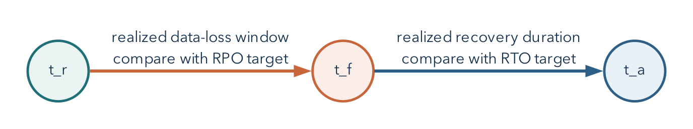

# A Backup Matters Only When Recovery Works

## Operating Question

If the original database disappears or a harmful change commits, what artifact can
recreate the required state, where can it be restored safely, and which checks
confirm that the result is usable?

## Learning Outcomes

After this module, you can:

- distinguish high availability, backup, restore, and disaster recovery;
- use recovery point and recovery time objectives to clarify a promise;
- explain logical and physical backup tradeoffs;
- create a free-tier-appropriate PostgreSQL logical backup command;
- restore into a separate target and verify structure, data, and behavior; and
- write a concise runbook with prerequisites, safety boundaries, and verification checks.

## Four Mechanisms Solve Different Problems

At 14:17, an administrator commits a DELETE with the wrong condition. The
database is still running, the network is healthy, and other queries work. A
server restart will not bring back the deleted rows: from the DBMS's perspective,
the deletion was an authorized, committed change. The team needs an earlier
recoverable state and a decision about which later valid changes to preserve.
This is a recovery problem even though it is not a hardware outage.

- **High availability** reduces service interruption when a component fails.
- **Backup** creates recoverable data outside the active state.
- **Restore** reconstructs data or objects from a backup artifact.
- **Disaster recovery** combines people, systems, procedures, alternate locations,
  and tested decisions for a serious failure.

A replica can quickly copy an accidental deletion. A backup can exist but be
corrupt, incomplete, inaccessible, or impossible to restore within the required
time. Redundancy and recovery complement each other.

## RPO and RTO Turn "We Have Backups" Into a Promise

**Recovery Point Objective (RPO)** is the maximum acceptable data-loss window. A
daily export may imply up to roughly one day of lost changes, depending on when
failure occurs.

**Recovery Time Objective (RTO)** is the target time to restore an acceptable
service. It includes obtaining credentials, provisioning a target, transferring
data, restoring, verifying, and reconnecting consumers.

RPO and RTO are requirements, not properties automatically created by writing
them down. Backup frequency, artifact retention, restore speed, and staffing must
support them.

If $t_f$ is the failure time and $t_r$ is the timestamp of the newest recoverable
state, the realized data-loss window is:

$$
\Delta_{\text{loss}}=t_f-t_r.
$$

The recovery design meets an RPO target $RPO_{\max}$ only when
$\Delta_{\text{loss}}\le RPO_{\max}$. If service becomes acceptable again at
$t_a$, the realized recovery duration is
$\Delta_{\text{recovery}}=t_a-t_f$ and must be compared with the RTO target.
These inequalities turn vague confidence into something that can be measured
during a restore drill.

### Work Through the Clock Times

Suppose the newest usable export represents the database at 14:00. The harmful
deletion occurs at 14:17, is recognized at 14:21, and the team finishes restoration
and verification at 14:29. The recoverable-data gap is 17 minutes. The
service-recovery interval measured from the failure is 12 minutes, not just the
eight minutes spent restoring and checking after detection. An RPO of five
minutes and an RTO of ten minutes would both be missed.

The 17-minute gap does not tell us how many records were lost. A quiet period and
a burst of thousands of writes can have the same time gap. It also does not mean
that every write after 14:00 is necessarily unrecoverable: another supported
history source might preserve some. State which sources the calculation assumes.
For a running logical export, the state represented is its consistent snapshot,
not automatically the wall-clock time when the output file finished writing.

RPO and RTO therefore start a conversation about a service's needs. A historical
classroom dataset may tolerate yesterday's state; an active request desk may not.
The target must be justified by the consequences of lost work and unavailable
service, not copied from a cloud provider's marketing page.

{#fig-recovery-timeline width=92%}

## Choose the Failure Scope First

Ask what must be recovered:

- one table after an incorrect delete;
- one schema after a migration failure;
- an entire database after project loss;
- credentials and permissions after access corruption;
- a service in a different region; or
- an application-consistent state spanning multiple systems.

The correct artifact and procedure depend on scope. A CSV export of one table may
help recover rows but does not preserve keys, constraints, indexes, views,
functions, roles, or transactionally consistent relationships by itself.

## Logical and Physical Backups

### Logical Backup

Logical tools export SQL objects and data in a form the DBMS can reconstruct.
PostgreSQL uses `pg_dump` for one database and `pg_dumpall` for cluster-wide
logical content such as roles, within supported permissions.

Benefits include object-level selection and portability across some PostgreSQL
versions. Costs can include longer export/restore time and incomplete coverage of
cluster-level configuration.

The logical export reconstructs the meaning of objects rather than copying the
server's live storage files byte for byte. It can recreate a table, load its rows,
and recreate its indexes. A consistent database snapshot keeps related exported
rows from representing unrelated moments. By contrast, independently downloading
several CSVs while the application changes can produce a child event whose parent
ticket is absent from the earlier parent export.

### Physical Backup

Physical backups copy database storage in a format tied more closely to the DBMS
and version, often combined with write-ahead logs for point-in-time recovery. They
can support large-system recovery and precise points but require platform support,
storage coordination, and operational expertise.

Managed services may expose snapshots or point-in-time recovery only on selected
plans. A recovery design must account for the features actually available on its
plan. The required course lab uses free tools.

Write-ahead logging records information needed to recover database changes. A
supported physical recovery design can restore a base backup and replay a
continuous sequence of retained log records to a selected point. The log is not
an ordinary spreadsheet of past business events. Losing required segments or
using an incompatible base backup can break the recovery chain. Setting up that
production infrastructure is outside the required beginner lab; understanding
why a single CSV cannot replace it is not.

## Free-Tier Reality in This Course

Supabase documentation states that projects on the Free plan do not receive the
automatic database backups available on paid plans. This course therefore treats
logical backup and restore as the required recovery path. Students never need to
pay for a backup feature.

{#fig-supabase-free-overview width=68%}

The two status fields describe different aspects of the system. **Healthy**
describes present availability. **No backups** reports the absence of a retained
backup in this displayed project history. Neither field establishes that a
separately stored export exists or can be restored. A logical recovery drill
tests those additional requirements.

Platform offerings change. Before relying on a backup feature, check the current
plan documentation and record that dependency in the recovery plan.

The assigned [recovery notebook](../notebooks/03_postgres_backup_restore.ipynb)
runs a real PostgreSQL dump and separate restore in disposable local databases.
It does not require a paid hosted backup feature. The command-line examples below
explain the same tools and provide a reference for a permitted remote source.
They are shell commands, not SQL to paste into a web SQL editor.

## Use `pg_dump` Without Publishing a Password

Obtain the source hostname, port, database name, and user from the approved
connection panel. Set the non-password shell variables `PGHOST`, `PGPORT`,
`PGDATABASE`, and `PGUSER` to those values. `--password` asks interactively for
the password without putting it in the command itself. Do not save a full
password-bearing URI in a script or pass it as a visible command-line argument.

For a remote Supabase connection, use a reachable direct endpoint or the
IPv4-compatible **session pooler** where needed, and the documented TLS settings.
Do not switch off certificate verification to address a network-routing error.
Use compatible PostgreSQL client tools: the same major version as the source is
a straightforward course choice. An older `pg_dump` cannot dump a newer-major
server. A restore to an older-major server is not promised to work.

Custom-format backup of the course schema:

```bash
pg_dump \
  --format=custom \
  --schema=metro_support \
  --file=metro_support.dump \
  --host="$PGHOST" --port="$PGPORT" \
  --username="$PGUSER" --dbname="$PGDATABASE" --password
```

Plain SQL backup of one schema:

```bash
pg_dump \
  --format=plain \
  --schema=metro_support \
  --no-owner \
  --no-privileges \
  --file=metro_support.sql \
  --host="$PGHOST" --port="$PGPORT" \
  --username="$PGUSER" --dbname="$PGDATABASE" --password
```

For an automated job, use an approved secret store or a restricted PostgreSQL
password file rather than inventing a way to echo the password into a command.

In plain SQL output, `--no-owner` and `--no-privileges` omit ownership and grant
commands to ease a portable restore. For a custom archive, ownership suppression
belongs on `pg_restore`; `pg_dump --no-owner` is ignored for that archive format.
The restore below intentionally omits original owners and grants, so a separate
reviewed access configuration is necessary before application use.
[PostgreSQL dump options](https://www.postgresql.org/docs/current/app-pgdump.html)

`--schema=metro_support` is a deliberate boundary. It is not a backup of the whole
Supabase project, its authentication system, file storage, or external services.
Objects outside that schema may be dependencies in a real application. A source
manifest should say what was included and what was not.

## Inspect the Artifact Before Depending on It

For a custom-format dump:

```bash
pg_restore --list metro_support.dump
```

For a plain SQL file, inspect its beginning and end with a text viewer and search
for expected table and data statements. Record file size and a cryptographic hash
if the artifact will be transferred or retained:

```bash
shasum -a 256 metro_support.dump
```

A list or checksum proves properties of the artifact, not that PostgreSQL can
successfully restore it.

Treat an untrusted dump as executable input. Current PostgreSQL documentation
warns that restoring a dump can execute SQL selected by source superusers. Inspect
the source and archive list, restore first into an isolated disposable target with
a least-privileged restore role, and never test an untrusted artifact directly
against production.

## Restore Into a Separate Target

Never test by overwriting the only copy. Create an empty, disposable database or
instructor-approved restore target.

Use separate `RESTORE_PGHOST`, `RESTORE_PGPORT`, `RESTORE_PGUSER`, and
`RESTORE_PGDATABASE` variables for the target. Inspect those values before running
the restore. A new schema name in the source database is not automatically a
separate restore target: the archive recreates the schema names it contains.
The course notebook creates a distinct database explicitly.

Custom format:

```bash
pg_restore \
  --host="$RESTORE_PGHOST" --port="$RESTORE_PGPORT" \
  --username="$RESTORE_PGUSER" --dbname="$RESTORE_PGDATABASE" \
  --password --single-transaction \
  --no-owner \
  --no-privileges \
  --exit-on-error \
  metro_support.dump
```

Plain SQL:

```bash
psql \
  --set=ON_ERROR_STOP=on \
  --host="$RESTORE_PGHOST" --port="$RESTORE_PGPORT" \
  --username="$RESTORE_PGUSER" --dbname="$RESTORE_PGDATABASE" \
  --password --single-transaction \
  --file=metro_support.sql
```

`--exit-on-error` and `ON_ERROR_STOP` make failures visible rather than allowing a
long process to appear successful after skipped errors.

For these small course archives, `--single-transaction` also avoids keeping a
half-restored set of transactional objects after an error. It is not suitable
for every restore mode or every possible script, and it does not clean up old
objects already in the target. Begin with the specified empty target; do not
add destructive `--clean` options to force a restore over something unfamiliar.
[PostgreSQL restore options](https://www.postgresql.org/docs/current/app-pgrestore.html)

## Verify Structure, Data, and Behavior

### Structure

```sql
SELECT table_name
FROM information_schema.tables
WHERE table_schema = 'metro_support'
ORDER BY table_name;
```

Inspect expected constraints and indexes as well as tables.

### Data

```sql
SELECT 'users' AS object, count(*) FROM metro_support.users
UNION ALL
SELECT 'tickets', count(*) FROM metro_support.tickets
UNION ALL
SELECT 'ticket_events', count(*) FROM metro_support.ticket_events;
```

Counts are necessary but not sufficient. Check a known relationship and a
boundary row.

For the full, unchanged Metro Support source fixture, the expected counts are
8 users, 12 tickets, and 21 events. The assigned recovery notebook deliberately
uses a smaller fixture: 3 users, 3 tickets, and 5 events. Establish the baseline
for the source you actually exported rather than borrowing counts from a
different example. In the full fixture, a second check can answer a specific question:

```sql
SELECT t.ticket_id, t.status, t.assignee_id, u.display_name AS requester
FROM metro_support.tickets AS t
JOIN metro_support.users AS u ON u.user_id = t.requester_id
WHERE t.ticket_id = 1004;
```

The baseline result is ticket 1004, status `new`, a NULL assignee, and requester
Jordan Bell. The NULL is expected, not a failed restoration. Compare with the
source state you actually backed up if earlier exercises committed changes.
Two different databases can have the same row counts, so this identity-and-value
check asks a different question from the count query.

### Behavior

Run one meaningful report and one expected-failure constraint test inside a
transaction. If access configuration is part of the recovery scope, test an
allowed and denied operation.

An error alone is insufficient. An invalid status should fail because of the
named status constraint, not because the server disconnected or the table name
was misspelled. PostgreSQL SQLSTATE `23514` identifies a check-constraint violation.
The notebook checks that code and the exact constraint name, then confirms the
test row was not retained. It uses a transaction that cannot commit even if a
missing constraint unexpectedly allows the insert. This is a small example of
testing the failure mechanism rather than accepting any failure as success.

The notebook also compares a ticket's subject and requester between source and
target. An incorrect subject can leave every table count unchanged. Conversely,
two equal query results can both be wrong if the source itself was wrong. Compare
the result with the intended record in the original fixture as well. Recovery
verification and source-data quality answer related but distinct questions.

### Application Boundary

If the recovery objective includes application service, use a temporary safe
configuration to test a real read and write path. Do not redirect production
traffic before verification and approval.

## Worked Example: A Recovery Runbook Entry

```text
Purpose: recover the Metro Support schema after an accidental destructive change.

Artifact: custom-format logical dump, created daily by an approved operator.

Prerequisites: pg_dump/pg_restore major version compatible with the server;
temporary source and restore credentials; empty restore target; enough storage.

Safety boundary: never restore over the source database. Never commit URLs.

Procedure: create dump; record exit code, size, and SHA-256; list contents;
restore with --exit-on-error into the separate target.

Verification: compare source and target table definitions; expected row counts;
ticket 1004 and its requester; one report; one rejected foreign-key change.
If security is in scope, restore reviewed roles/grants and test them separately.

Success decision: the required checks pass for this recovery scope. Application
traffic is not redirected until its owner approves the verified target.

Cleanup: revoke temporary credentials and remove the restore target according to
the retention policy.
```

## Safe Migrations and Recovery Are Connected

A backup before a migration is useful only if:

- it includes the necessary scope;
- it can be restored within the decision window;
- the old application remains compatible with the restored state; and
- the team knows whether rollback, forward fix, or restore is safest.

For small changes, transactional DDL and a tested rollback may be faster. For a
destructive data transformation, restore may be part of the response. Plan before
execution.

## Common Misconceptions

### "The dump command returned, so recovery is ready"

Exit status, artifact inspection, separate restore, and verification are still
required.

### "A CSV is a full database backup"

CSV can preserve selected row values but usually omits schema, constraints,
indexes, permissions, and transactionally consistent multi-table state.

### "A replica protects against deletion"

Replication can reproduce the deletion. Recovery needs an artifact or history
outside the active state and a tested procedure.

### "RPO and RTO are the same"

RPO concerns acceptable data loss; RTO concerns acceptable recovery duration.

## Study and Practice

Before Day 1, read through "Free-Tier Reality in This Course" and the verification
discussion; use the command explanations as a reference during the notebook.
Before Day 2, read the runbook and migration/recovery discussion for the clinic. The
assigned lab asks for a real restore and one additional known-record check, not
a second extensive checklist. The exercise below is optional self-study.

Write a restore verification checklist for Metro Support with:

1. two structure checks;
2. two data checks;
3. one behavior check;
4. one access check; and
5. one statement of what the checklist does not prove.

## Retrieval and Transfer

1. How does high availability differ from backup?
2. What does an RPO of four hours mean?
3. Why restore into a separate target?
4. What do `--no-owner` and `--no-privileges` trade away?
5. Why is a row count not complete restore verification?
6. Which free-tier constraint changes the required Supabase recovery lab?

## Further Reading

- [PostgreSQL backup and restore](https://www.postgresql.org/docs/current/backup.html)
- [PostgreSQL `pg_dump`](https://www.postgresql.org/docs/current/app-pgdump.html)
- [PostgreSQL `pg_restore`](https://www.postgresql.org/docs/current/app-pgrestore.html)
- [Supabase database backups](https://supabase.com/docs/guides/platform/backups)
- [Supabase connection guidance](https://supabase.com/docs/guides/database/connecting-to-postgres)
