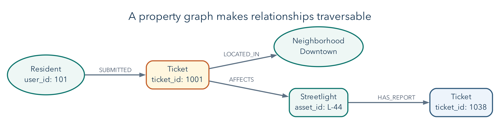
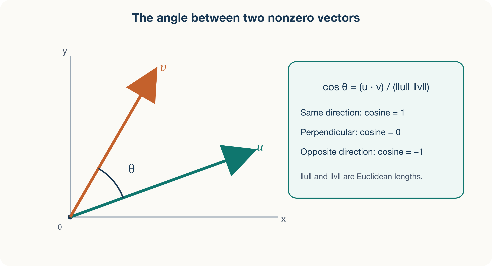
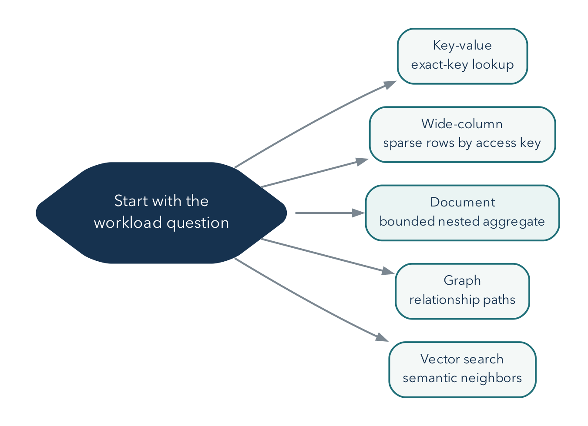

# Documents Emerged From Changing Workloads

## Operating Question

If you designed a data system today, which relational ideas would you keep, what
might you change, and which workload would justify that change?

## Learning Outcomes

After this module, you can:

- explain why NoSQL emerged without claiming that relational databases became
  obsolete;
- compare key-value, wide-column, document, graph, and vector abstractions;
- write and validate strict JSON objects and arrays;
- distinguish JSON text from MongoDB's BSON document representation;
- represent the same CSV relationships in more than one valid JSON shape; and
- evaluate flexibility in terms of reads, writes, duplication, growth, and
  integrity.

## Relational Databases Solved a Real Historical Problem

The first half of the course asked how to preserve meaning while many people
query and change shared tables. Those questions do not disappear when records
become documents or when a database moves to several machines. This chapter
changes the shape of the discussion, not the standard of correctness. We will
ask what an application needs to retrieve together, how relationships change,
and which responsibilities a different storage model moves to the application.

In 1970, E. F. Codd proposed the relational model as a way to separate logical data
relationships from physical storage details. Relations, keys, declarative queries,
constraints, and transactions remain powerful because they let many workloads ask
new questions while preserving shared meaning.

The later rise of NoSQL did not prove those ideas wrong. It reflected new pressures:

- globally distributed services;
- very high write or read throughput;
- data whose fields changed frequently;
- hierarchical objects moving through web applications;
- specialized traversals, sparse records, caches, and search; and
- engineering teams willing to trade generality for a workload-specific shape.

## "NoSQL" Has More Than One Historical Meaning

Carlo Strozzi used the name NoSQL in 1998 for a relational DBMS that used Unix
tools rather than SQL. That system was still relational. Around 2009, the label
was reused for a meetup and a growing set of non-relational, often distributed
datastores. The later slogan "not only SQL" emphasizes coexistence, but it is not
a precise technical definition.

Important influences included:

- Google's 2006 Bigtable paper, which described a distributed structured store
  with a sparse, multidimensional data model; and
- Amazon's 2007 Dynamo paper, which described a highly available key-value system
  designed for an "always-on" service experience.

Products inspired by these systems made different choices. No single consistency,
schema, transaction, or query rule applies to every NoSQL database.

Bigtable and Dynamo illustrate different pressures rather than a single
replacement for relational systems. Bigtable organized a very large sparse map
using row keys, column keys, and timestamps. Dynamo emphasized availability for
key-addressed data and described replication and version-reconciliation choices.
Reading their design problems helps explain why workload matters more than the
label "NoSQL."
[Google's Bigtable paper](https://research.google/pubs/bigtable-a-distributed-storage-system-for-structured-data/),
[Amazon's Dynamo paper](https://www.amazon.science/publications/dynamo-amazons-highly-available-key-value-store)

Do not transfer a 2007 research-system limitation to every present-day product
with a similar name. Amazon's Dynamo research system and the later DynamoDB
service are not identical specifications. Modern systems also cross categories:
a relational system can store JSON or support vector search, and a document
system can support transactions. The categories describe useful abstractions,
not mutually exclusive boxes containing every possible feature.

## Choose an Abstraction for a Workload

### Key-Value Store

Model: a mapping from a unique key to a value.

```text
"session:8fd2" -> {"user_id": 101, "expires_at": "..."}
```

Strengths include direct lookup, caching, sessions, counters, and simple
partitioning. If the system cannot inspect fields inside the value efficiently,
questions that do not know the key become difficult. Redis is a widely used
example with richer value structures than a bare string map.

For a session lookup, the application already has the session key and wants its
value. For "find every unexpired session belonging to this user," it may not
know the relevant keys. That second question needs another access structure, a
scan, or a redesigned key arrangement. This is the same distinction as finding a
ticket by its primary key versus reporting tickets by neighborhood: a fast path
for one question is not a fast path for every question.

### Wide-Column Store

Model: rows located by a row key, with sparse or dynamic columns commonly grouped
into column families.

This abstraction suits large, distributed workloads organized around known access
keys and ranges, such as time-ordered events by device. Google Bigtable and
systems influenced by it demonstrate this family. It is not the same as an
analytical columnar file or warehouse merely because both use the word "column."

For example, a row key beginning with a device identifier can place that device's
measurements together. That helps "read this device's recent measurements" but
may not help "find all devices that exceeded a threshold today." A key that
groups data conveniently can also concentrate writes. Chapter 13 returns to that
distribution problem without requiring students to administer a sharded cluster.

### Document Store

Model: field-named, nested records addressed and queried by their contents.

```json
{
  "ticket_id": 1001,
  "status": "open",
  "requester": {"user_id": 101, "name": "Maya Chen"},
  "tags": ["streetlight", "safety"]
}
```

Documents align naturally with objects and API payloads. Related facts read and
changed together can live together. The design must still address duplication,
unbounded arrays, shared ownership, validation, indexes, and access patterns.
MongoDB is the course's document database.

A field name makes structure visible, but not every meaning self-evident.
`"priority": 3` does not explain whether 3 is urgent, low, or an external code.
Likewise, a nested requester can be the requester's current profile or a snapshot
from the day a ticket opened. A document needs a semantic contract just as a
relational table does.

### Graph Database

A graph is commonly written $G=(V,E)$, where $V$ is a set of vertices and $E$ is
a set of edges. Vertices represent entities; edges represent relationships. A
property graph can store attributes on both.

```text
(resident 101)-[REQUESTED]->(ticket 1001)-[ASSIGNED_TO]->(agent 201)
```

Basic graph ideas:

- **directed edge:** `A -> B` has a direction;
- **undirected edge:** connection has no direction for the model;
- **degree:** $\deg(v)$, the number of edges incident to vertex $v$;
- **path:** a sequence $v_0,e_1,v_1,\ldots,e_k,v_k$ of connected vertices and
  edges;
- **shortest path:** path minimizing edge count or a weight; and
- **connected component:** vertices reachable from one another under the chosen
  direction rules.

For a directed graph, distinguish **in-degree** from **out-degree**: incoming
connections and outgoing connections answer different questions. In a directed
dependency graph, "depends on" and "is depended on by" are not interchangeable.
Connectivity also has two common meanings: weak connectivity ignores arrow
direction; strong connectivity requires directed paths both ways. We use simple
examples without parallel edges or self-loops unless stated otherwise.

Graph databases are useful when the relationship path is the question: fraud
rings, dependency impact, network topology, recommendations, authorization paths,
or knowledge graphs. A graph is not automatically better for ordinary records
that are mostly retrieved by identifier.

{#fig-graph-path width=96%}

In the pictured path, the question "Which other reports involve an asset touched
by this resident's ticket?" is naturally a traversal. A relational database can
answer it with joins and a recursive common table expression; a graph database
makes the path the primary abstraction. The choice follows the dominant workload,
not the presence of relationships by itself.

Consider a second example with assets and their dependencies:

```text
repair portal -> identity service -> database
repair portal -> ticket API      -> database
```

An edge means "the left service depends on the right service." From the portal,
following arrows finds its dependencies. Starting at the database and following
arrows backward finds potentially affected services. Counting one-hop neighbors
alone misses the portal, which is two hops away. A breadth-first traversal
explores one-hop neighbors, then two-hop neighbors, and so on; tracking visited
vertices prevents repeatedly circling a dependency cycle. With equal edge costs,
the first discovered path has the fewest hops. If edges represent unequal travel
times or costs, fewest hops is no longer necessarily cheapest.

This is why graphs are useful for dependency impact and connected patterns.
Whether a particular failure actually affects a service still depends on
redundancy, fallback paths, and the meaning assigned to each edge. A diagram of
connections is not automatically an outage prediction.

### Vector Store or Vector Search

A vector represents an item as a point in a numeric space, often produced by a
machine-learning embedding model. Similar items should be near one another under a
chosen measure.

You can begin with a vector as an ordered list of numbers. In two dimensions,
`[3, 4]` can mean a point three units along one axis and four along another. An
embedding model may instead produce hundreds of coordinates learned from text,
images, or other data. Individual coordinates need not have simple human labels.
The model turns an item into numbers; the database stores and searches those
numbers. Adding a vector index does not itself train the model or establish that
the retrieved items are relevant.

For nonzero vectors $\mathbf{a},\mathbf{b}\in\mathbb{R}^{n}$, cosine similarity
is:

$$
s_{\cos}(\mathbf{a},\mathbf{b})
=
\frac{\mathbf{a}\cdot\mathbf{b}}
{\lVert\mathbf{a}\rVert_2\,\lVert\mathbf{b}\rVert_2}
$$

The dot product and Euclidean norm are:

$$
\mathbf{a}\cdot\mathbf{b}=\sum_{i=1}^{n}a_i b_i,
\qquad
\lVert\mathbf{a}\rVert_2=\sqrt{\sum_{i=1}^{n}a_i^2}.
$$

It measures the angle between nonzero vectors. Two vectors pointing in the same
direction have similarity near 1 even if one has larger magnitude. Euclidean
distance measures straight-line distance and is sensitive to magnitude. Cosine is
often useful when direction represents semantic pattern and vector length is not
the desired signal.

Euclidean distance is written:

$$
d_2(\mathbf{a},\mathbf{b})
=
\lVert\mathbf{a}-\mathbf{b}\rVert_2
=
\sqrt{\sum_{i=1}^{n}(a_i-b_i)^2}.
$$

Cosine similarity compares direction; Euclidean distance compares geometric
separation. The metric must match how the embedding model and application assign
meaning to the vector space.

### Calculate a Small Example

Let the query be $\mathbf{q}=(1,0)$, with candidates
$\mathbf{a}=(10,0)$ and $\mathbf{b}=(1,1)$. The dot product multiplies matching
coordinates and adds the products. Thus $\mathbf{q}\cdot\mathbf{a}=10$ and
$\mathbf{q}\cdot\mathbf{b}=1$. The Euclidean norm is a vector's length from the
origin: the lengths are $1$, $10$, and $\sqrt{2}$ respectively.

$$
s_{\cos}(\mathbf{q},\mathbf{a})=\frac{10}{1\cdot10}=1,
\qquad
s_{\cos}(\mathbf{q},\mathbf{b})=\frac{1}{\sqrt{2}}\approx0.707.
$$

But the straight-line distances are:

$$
d_2(\mathbf{q},\mathbf{a})=9,
\qquad d_2(\mathbf{q},\mathbf{b})=1.
$$

Cosine ranks A as more similar because it points in exactly the same direction.
Euclidean distance ranks B as closer because its coordinates are nearer. Neither
calculation is wrong. They answer different questions. If magnitude represents
an important amount, discarding it can be a mistake. If vector length varies for
reasons irrelevant to the desired similarity, direction can be the better signal.
These toy coordinates explain geometry; they are not measurements of language
meaning.

Cosine is undefined for the zero vector because the denominator would be zero.
For other real vectors its range is from -1 to 1; a negative score means an
opposing direction, not a negative probability. Also, many retrieval systems
transform raw similarities into their own score ranges. Read the definition of
the returned score before comparing it to a threshold.

Normalizing a nonzero vector means dividing every coordinate by its length. For
unit-length vectors, the measures are closely related:

$$
\lVert\widehat{\mathbf{a}}-\widehat{\mathbf{b}}\rVert_2^2
=2-2\,s_{\cos}(\mathbf{a},\mathbf{b}).
$$

The hat marks a normalized vector. Expanding the squared distance gives the
first vector's squared length, plus the second's, minus twice their dot product.
The first two terms are each 1 after normalization. Therefore, on the same
normalized vectors, maximizing cosine gives the same exact ranking as minimizing
Euclidean distance, apart from ties and numerical precision. This is more precise
than saying cosine is always better than distance.

{#fig-vector-geometry width=92%}

Exact nearest-neighbor search returns the closest records under the chosen
measure. A brute-force baseline compares every vector; exact index methods can
also prune candidates without changing the answer. For example, a k-d tree can
skip regions that cannot contain a closer point. Approximate nearest-neighbor
indexes may omit true neighbors in exchange for less search work. Whether the
tradeoff helps depends on the data, workload, and index configuration.
[SciPy's k-d tree query documentation](https://docs.scipy.org/doc/scipy/reference/generated/scipy.spatial.cKDTree.query.html)
distinguishes exact and approximate queries and describes pruning.
Vector search may be a feature inside relational or document systems rather than
a completely separate database family. The operational questions remain: which
model produced the vector, how it is versioned, which distance measure matches the
meaning, how recall is evaluated, and how source records stay synchronized.

For example, if an exact search's top five contain five known record IDs and an
approximate search returns three of those IDs, recall at five is $3/5=0.6$ for
that query. It measures agreement with the exact retrieval target, not whether a
human considers the results useful or fair. Evaluate relevance with appropriate
examples too. Privacy rules still apply: a similar ticket is not necessarily a
ticket the current user may read.

Vector search is a conceptual comparison in this chapter, not a requirement to
buy a service, obtain an embedding API key, or configure a new index. Current
[MongoDB Vector Search documentation](https://www.mongodb.com/docs/vector-search/)
describes the product-specific implementation; the JSON lab needs only a text
editor.

## Specialized Models Trade Generality for Directness

| Workload question | Natural first model | Important tradeoff |
|---|---|---|
| fetch session by exact token | key-value | limited ad hoc field queries |
| write time-ordered device readings by device | wide-column | design tied to row key and access pattern |
| load a ticket with bounded nested details | document | duplication and document growth |
| find paths among accounts and devices | graph | relationship-oriented operations and new tooling |
| find semantically similar incident descriptions | vector search | approximate results and embedding lifecycle |
| enforce shared entities and flexible reporting | relational | joins and schema-change coordination |

{#fig-nosql-models width=94%}

Real systems can combine models. Each added store creates more access control,
monitoring, backup, synchronization, and expertise obligations. Polyglot design is
a cost-benefit decision, not a trophy.

## JSON Became a Common Interchange Format

JavaScript Object Notation grew from JavaScript object-literal syntax and was
standardized as a minimal, textual, language-independent interchange format. The
current Internet standard is RFC 8259; ECMA-404 defines the syntax in parallel.
The registered media type is `application/json`.

Douglas Crockford's RFC 4627 documented JSON in 2006. RFC 7159 revised the
specification in 2014, and RFC 8259 became the Internet-standard specification
in 2017. The sequence reflects the need for different implementations to exchange
the same data predictably. Historical documents explain the development; use the
current specification for interoperability rules.
[RFC 4627](https://www.rfc-editor.org/info/rfc4627/),
[RFC 7159](https://www.rfc-editor.org/info/rfc7159/),
[RFC 8259](https://www.rfc-editor.org/info/rfc8259/)

JSON became popular because it is:

- compact enough for network exchange;
- readable and writable across many programming languages;
- natural for nested API data;
- easy to parse with standard libraries; and
- less verbose than XML for many application payloads.

Popularity does not make every JSON design good. A valid document can still have
ambiguous names, inconsistent types, duplicated facts, unsafe content, or no
versioning strategy.

Consider an API that returns a ticket and a list of events. A CSV naturally
represents a rectangular table; it needs conventions to represent a nested list
within one field. JSON has objects and arrays built into its syntax, so the API
can represent that structure directly. It is still text that must be parsed and
validated. A JavaScript expression, a Python dictionary, and a JSON document can
look similar while being different languages with different valid spellings.

## JSON Has Six Value Kinds

A JSON value can be:

- object;
- array;
- string;
- number;
- `true` or `false`; or
- `null`.

Object names are strings. Objects are unordered collections of name/value pairs;
arrays are ordered sequences.

Read `{}` as "one object with named properties" and `[]` as "a list of values."
A colon connects a property name to its value. Commas separate neighbors at the
same level. Indentation does not change the represented data, but it makes the
containment visible to a reader.

```json
{
  "ticket_id": 1001,
  "open": true,
  "closed_at": null,
  "priority": "high",
  "coordinates": [40.69, -73.99],
  "requester": {
    "user_id": 101,
    "display_name": "Maya Chen"
  }
}
```

Strict JSON requires double-quoted names and strings. It does not permit comments,
trailing commas, `undefined`, single-quoted strings, or native date values.

These are invalid:

```text
{'status': 'open'}                 # single quotes
{"status": "open",}             # trailing comma
{"opened_at": 2026-02-01T10:00Z} # unquoted timestamp
```

An application commonly encodes a date as an agreed string. MongoDB's BSON format
adds types such as date and ObjectId that are not native JSON types. Atlas and
drivers may display Extended JSON when representing those types as text.

### Missing, Null, Empty, and Zero Are Different

These four objects can describe different situations:

```json
[
  {"ticket_id": 1004},
  {"ticket_id": 1004, "assignee_id": null},
  {"ticket_id": 1004, "events": []},
  {"ticket_id": 1004, "estimated_cost": 0}
]
```

The first omits an assignee property. The second explicitly supplies null. The
third supplies a list with no events, while the fourth supplies a numeric zero.
An application may choose to treat omitted and null assignees alike, but that is
its contract, not something the JSON syntax guarantees. An empty event list also
does not tell us whether history truly does not exist or simply was not included
in this response. A field such as `history_included` could make that distinction
explicit if the application needs it.

### Valid Syntax Does Not Guarantee Interoperability

Use distinct property names within an object. Some parsers accept duplicate names
but retain different values, which makes the document unreliable for exchange.
Use strings for identifiers whose spelling matters, such as postal codes with
leading zeros. JSON has a number syntax, but receiving languages can impose
different range and precision limits. Very large numeric IDs can lose precision
in a JavaScript number; an agreed string representation avoids treating such IDs
as arithmetic quantities. For exact amounts, define a documented representation
such as integer cents within a safe range or a decimal string interpreted by a
decimal-capable application.

Use a JSON parser, not a language's general-purpose `eval`, to read JSON text.
Parsing recognizes data syntax; evaluating arbitrary expressions executes code.
For optional local checking, Python's standard library can parse a short example:

```python
import json

text = '{"ticket_id": 1004, "assignee_id": null, "events": []}'
ticket = json.loads(text)
print(ticket["ticket_id"])       # 1004
print(ticket["assignee_id"])     # None: Python's null-like value
print(json.dumps(ticket, indent=2))
```

`loads` turns JSON text into Python values; `dumps` turns supported Python values
back into JSON text. Python `None` becomes JSON `null`. For this standard-compliant
input, the round trip checks representation, not the truth of the ticket's facts.
Python's default parser also accepts `NaN` and `Infinity`, which are outside
standard JSON, and retains the last value when a member name repeats. Therefore,
successful `json.loads` alone is not a strict interoperability check.
`allow_nan=False` rejects nonfinite numbers when writing JSON; rejecting them when
reading requires a `parse_constant` policy. These are separate settings. The
[Python JSON documentation](https://docs.python.org/3/library/json.html#standard-compliance-and-interoperability)
explains these behaviors. Students may complete the assigned lab without running
Python.

## Flexibility Means Multiple Shapes Are Possible

Three CSV tables can become many valid JSON designs.

The short sketches below isolate a design idea, so they omit selected fields or
events. They are not complete conversions of ticket 1001. The complete paired
example afterward retains the same selected facts in both shapes.

### Referenced Collections

```json
{
  "ticket_id": 1001,
  "requester_id": 101,
  "assignee_id": 201,
  "status": "open"
}
```

Events can remain separate documents containing `ticket_id`. Shared users have one
source of truth, but reading a full ticket history requires additional queries or
a join-like operation.

### Embedded Ticket

```json
{
  "ticket_id": 1001,
  "status": "open",
  "requester": {
    "user_id": 101,
    "display_name": "Maya Chen"
  },
  "events": [
    {
      "event_id": 5001,
      "type": "created",
      "at": "2026-02-01T23:10:00Z"
    }
  ]
}
```

One read can return the ticket and the included portion of its history. This
sketch includes event 5001 but omits event 5002 from the source CSV. It therefore
does not contain the complete supplied history. The document duplicates requester
display data and can grow without bound if events continue forever.

### Snapshot Plus Reference

```json
{
  "ticket_id": 1001,
  "requester_id": 101,
  "requester_name_at_open": "Maya Chen",
  "recent_events": [
    {"event_id": 5002, "type": "assigned"}
  ]
}
```

This design intentionally keeps a historical snapshot and a reference. It needs a
rule explaining which field is authoritative and how recent events are bounded.

The right question is not "Which JSON is correct?" It is "Which shape makes the
important reads and atomic changes direct while keeping duplication, growth, and
integrity manageable?"

## Flexible Schema Is Still a Schema

Even if the database accepts different fields, applications assume names, types,
and structures. That assumed contract is a schema. If one document stores
`priority: "high"` and another stores `priority: 3`, every query and client must
handle both or fail.

Flexibility helps when variation is intentional and understood. It is harmful when
variation is accidental. MongoDB supports schema validation for established
invariants, which Module 11 applies.

## Worked Example: Compare Two Ticket Shapes

Before comparing access patterns, make the information in the two alternatives
equivalent. Use ticket 1001, users 101 and 201, and events 5001 and 5002 from
Metro Support. Retain the ticket ID, subject, status, requester, and assignment,
the users' IDs and display names, and each event's ID, type, and timestamp. Other
CSV fields are outside this example's scope.

### Complete Referenced Representation

```json
{
  "users": [
    {"user_id": 101, "display_name": "Maya Chen"},
    {"user_id": 201, "display_name": "Priya Shah"}
  ],
  "tickets": [{
    "ticket_id": 1001,
    "subject": "Streetlight dark near bus stop",
    "status": "open",
    "requester_id": 101,
    "assignee_id": 201
  }],
  "events": [
    {"event_id": 5001, "ticket_id": 1001,
     "event_type": "created", "event_at": "2026-02-01T23:10:00Z"},
    {"event_id": 5002, "ticket_id": 1001,
     "event_type": "assigned", "event_at": "2026-02-02T14:05:00Z"}
  ]
}
```

This is one interchange object containing three arrays, not three MongoDB
collections created by writing a file. For a ticket page, match `requester_id`
and `assignee_id` with `user_id`. Match each event's `ticket_id` with the ticket.
The IDs carry the relationships while the records remain separate.

### Complete Embedded Representation

```json
{
  "ticket_id": 1001,
  "subject": "Streetlight dark near bus stop",
  "status": "open",
  "requester": {"user_id": 101, "display_name": "Maya Chen"},
  "assignee": {"user_id": 201, "display_name": "Priya Shah"},
  "events": [
    {"event_id": 5001, "event_type": "created",
     "event_at": "2026-02-01T23:10:00Z"},
    {"event_id": 5002, "event_type": "assigned",
     "event_at": "2026-02-02T14:05:00Z"}
  ]
}
```

Containment now connects events to ticket 1001. Both event IDs and timestamps
survive. A later export of an event on its own would need its ticket context
again. The two embedded names are copies if authoritative user records exist
elsewhere. A field meaning the current name needs an update policy. A deliberately
historical name, such as `requester_name_at_open`, should retain its historical
meaning rather than silently follow every future change.

### The Same Facts, Different Operating Consequences

**Access patterns:**

1. show a ticket with its five most recent events;
2. append one event when status changes;
3. report event counts across all tickets by event type; and
4. preserve history for years.

Embedding every event makes the first two operations direct and single-document
atomic. Unbounded growth and the cross-ticket report become concerns. Keeping all
events separate supports long history and cross-ticket aggregation but requires a
second query for the ticket page.

A plausible beginner design references a separate authoritative events collection
and optionally embeds a small, explicitly bounded recent-event summary. The
important part is documenting the boundary, not maximizing nesting.

The recent-event list is a copy, so it also needs a refresh rule. Retaining only
five preview events must not accidentally delete the complete authoritative
history. Moreover, updating separate ticket and event documents is not
automatically one atomic operation. A later implementation must choose a supported
coordination strategy or explicitly define acceptable temporary inconsistency.
The beginner exercise asks students to identify that responsibility, not to build
a synchronization service.

## Common Misconceptions

### "NoSQL means no schema"

The schema may be implicit, flexible, or validated selectively. Applications
still depend on structure.

### "JSON supports dates"

Strict JSON does not have a date type. A string convention or an extended storage
format supplies date semantics.

### "Embedding removes relationships"

It represents a relationship through containment. Ownership, duplication, and
growth still need decisions.

### "Vector similarity understands meaning"

Similarity reflects a model, data, metric, and index. It is an engineered estimate
that must be evaluated for the task.

## Study and Practice

Before Day 1, read the historical and data-model sections through "Specialized
Models Trade Generality for Directness." Before Day 2, read the JSON and document
shape sections. The weekly lab bounds the data to one ticket and three events;
the broader practice below is optional, not a requirement to convert the entire
dataset.

Using the three Metro Support CSV files, sketch two JSON designs:

1. a referenced design; and
2. an embedded or hybrid design.

For each, state one read it improves, one update it complicates, one duplicated or
growing field, and one rule that should be validated.

## Retrieval and Transfer

1. Why is the 1998 use of "NoSQL" different from the later movement?
2. Which data-model family makes paths a first-class question?
3. How do cosine similarity and Euclidean distance differ?
4. Which JSON value kinds exist?
5. Why is a valid JSON document not necessarily a good data model?
6. Which workload measurements would support embedding ticket events?

## Further Reading

- [RFC 8259, JSON](https://www.rfc-editor.org/info/rfc8259/)
- [Debian's preserved package record for Carlo Strozzi's NoSQL RDBMS](https://sources.debian.org/src/nosql/3.1-4/nosql.lsm/)
- [Google, *Bigtable* paper](https://research.google/pubs/bigtable-a-distributed-storage-system-for-structured-data/)
- [Amazon, *Dynamo* paper](https://www.amazon.science/publications/dynamo-amazons-highly-available-key-value-store)
- [Martin Fowler and Pramod Sadalage, NoSQL key points](https://martinfowler.com/articles/nosqlKeyPoints.html)
- [MongoDB data modeling](https://www.mongodb.com/docs/manual/data-modeling/)
- [MongoDB `$similarityCosine` versioned reference](https://www.mongodb.com/docs/manual/reference/operator/aggregation/similaritycosine/)
- [MongoDB Vector Search](https://www.mongodb.com/docs/vector-search/)
