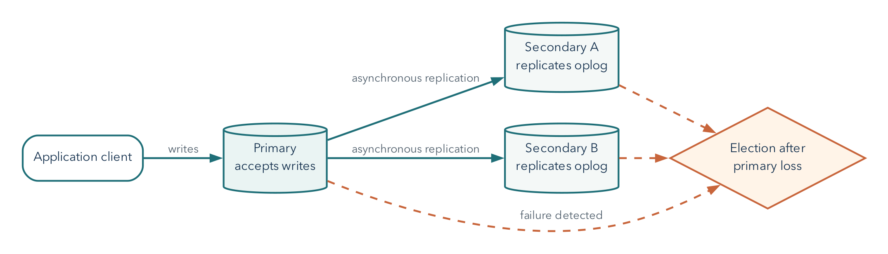

# Reliability Is a Set of Explicit Promises

## Operating Question

When a managed document database has multiple nodes, which failures can it hide,
which data can a client read or lose, and which separate recovery artifact still
needs to exist?

## Learning Outcomes

After this module, you can:

- explain primary, secondary, oplog, election, and failover roles in a replica set;
- distinguish read preference, read concern, and write concern;
- describe the CAP tradeoff during a network partition without using "pick any
  two" as a product label;
- distinguish replication from backup;
- create a free-tier-appropriate MongoDB logical recovery plan; and
- connect a reliability promise to mechanism, failure, verification, and limitation.

## Reliability Begins With a Specific Promise

The resident presses Submit, sees a confirmation, and closes the browser. One
database member fails immediately afterward. The resident's question is not
"how many servers were provisioned?" It is "does my confirmed request still
exist, and can I read it?" Reliability connects a user-visible promise to the
failure conditions under which the system can keep it.

"Highly available" is incomplete. A useful promise identifies:

- operation: read, write, query, restore, or reconnect;
- failure: process crash, node loss, network partition, bad deployment, or
  deletion;
- acceptable behavior: continue, reject, retry, use older data, or recover later;
- time or data-loss objective; and
- verification and limitation.

Example:

> A ticket write acknowledged with majority write concern should survive loss of a
> minority of voting data-bearing replica-set members, subject to the deployment's
> durability settings. This does not protect against a later authorized deletion,
> so a separate logical recovery artifact is required.

## Replica Sets Copy an Ordered Change History

A MongoDB replica set contains members that maintain the same logical dataset.

- The **primary** accepts writes under normal operation.
- **Secondaries** replicate operations from the primary's oplog and apply them.
- The **oplog** is a bounded, ordered log of data changes used for replication.
- An **election** can choose a new primary when the old one is unavailable and a
  voting majority can agree.

Replication is asynchronous. A secondary can lag behind the primary. Election and
client reconnection take time, so failover is not instantaneous or invisible to
every operation. Drivers discover topology and retry only according to supported
settings and operation semantics.

Suppose A is primary and B and C are secondaries. A write reaches A first and is
then replicated. During a brief interval, B may have applied it while C has not.
That does not mean the replicas are independent backups; they are catching up
with the active change history. If a secondary falls farther behind than the
retained oplog history can cover, normal incremental catch-up may no longer be
enough and resynchronization is needed. A bounded replication log is not an
indefinite archive of every historical application state.

Atlas Free uses a fixed three-node replica-set configuration, but students cannot
change its replication factor or run Atlas failover testing. We analyze topology
and client behavior rather than claiming to perform an unavailable test.

{#fig-replica-set width=94%}

## Write Concern Defines Required Acknowledgment

Write concern describes what acknowledgment a client waits for.

The following shell example belongs in a fresh disposable database, not in the
previous chapter's validated fixture. Its stable `_id` identifies this particular
submission attempt. The example observes a normal acknowledgment; it does not
perform or certify a failover test.

```javascript
const reliabilityPracticeName = "cst4714_reliability_" + ObjectId().toHexString().slice(-8);
db = db.getSiblingDB(reliabilityPracticeName);
db.tickets.insertOne(
  {
    _id: "submission-1099", ticket_id: 1099,
    status: "new", subject: "Write concern test"
  },
  { writeConcern: { w: "majority", wtimeout: 5000 } }
)
```

For a typical three-member replica set, `w: "majority"` requires acknowledgment
from a calculated majority of voting data-bearing members. Waiting for more
acknowledgments can improve the write's resilience to rollback but can add latency
or reduce successful writes when enough members are unavailable.

A write-concern timeout means the requested acknowledgment was not received in
time. It does not necessarily prove that no member applied the write. Applications
need idempotent identifiers, read-back strategy, and retry rules that avoid
creating duplicates.

Here the identifier gives a read-back question: does `submission-1099` exist,
and does its content match the requested operation? Repeating the insert with
the same identifier cannot silently create a second document with that `_id`.
A duplicate-key error is not a general success signal, however; a caller must
confirm that the existing record represents the same intended submission. An
identifier reused for a different request would be another error.

For the ordinary three-data-bearing-member example, a majority is two. Durability
also depends on journaling and the documented write-concern behavior; do not
generalize this arithmetic to every voting or arbiter configuration. A
`wtimeout` bounds the acknowledgment wait, not necessarily completion of the
underlying write. Losing the response can leave the caller uncertain even when
the write is eventually retained.
[MongoDB write concern](https://www.mongodb.com/docs/manual/reference/write-concern/)

Write concern is not backup retention. A majority-acknowledged deletion is still a
durable deletion.

## Read Preference Chooses Eligible Members

Common read preference modes include:

- `primary`: read from the primary; default for normal driver reads;
- `primaryPreferred`: prefer primary, permit secondary under documented conditions;
- `secondary`: read from a secondary;
- `secondaryPreferred`: prefer a secondary, permit primary; and
- `nearest`: select among eligible members by latency window and tags.

Reading from a secondary can distribute some read work or serve locality goals,
but asynchronous replication means the result may be behind the primary. A
read-your-own-write workflow should not switch casually to a lagging secondary.

Read preference is routing. It is not the same as read concern.

## Read Concern Defines Visibility Guarantees

Read concern controls the consistency and isolation properties of returned data.
For example, `local` can return data from the member without guaranteeing that a
majority has durably committed it; `majority` limits reads to majority-committed
data under its documented semantics.

The combined behavior depends on read preference, read concern, write concern,
sessions, and topology. Avoid describing a whole database as simply "consistent"
or "eventually consistent" without naming the operation and settings.

Think of the three controls as separate questions: **where may I read**, **which
state may that read return**, and **what must be acknowledged before my write
returns**? A majority read from a lagging eligible member is not a promise that
the latest possible write is immediately visible everywhere. For workflows that
must read their own preceding write, MongoDB documents causal sessions with the
appropriate majority read and write concerns. A primary-only read shortcut does
not replace understanding failure, session, and ordering behavior.
[Read isolation, consistency, and recency](https://www.mongodb.com/docs/manual/core/read-isolation-consistency-recency/)

## CAP Is a Partition-Time Tradeoff

The CAP theorem concerns a distributed read/write data object when messages
between parts of the system can be lost or delayed indefinitely.

- **Consistency** in the theorem is a single-copy/linearizable style guarantee,
  not the generic ACID consistency property.
- **Availability** means each operation requested at a non-failing node completes
  with the required operation response. Returning "unavailable" to every request
  is not a solution, and this definition is not a monthly uptime percentage.
- **Partition tolerance** addresses communication partitions between nodes.

When a partition separates nodes, a system cannot guarantee both that every
partition continues answering every request and that all answers behave like one
current copy. It must reject or delay some operations, permit potentially divergent
or stale behavior, or use a more specific compromise.

"Choose two of three" is misleading because a real distributed system cannot wish
network partitions away. The practical question is which operations remain
available during a partition and which consistency behavior they sacrifice or
preserve.

### What the Partition Forces Us to Decide

Suppose A and B can communicate, but C cannot exchange messages with them. A
resident's write reaches the A/B side and completes there. A later read reaches
C. C cannot know that new value by asking the other side while the partition
persists. If C answers from old state, it can violate the single-current-copy
promise. If it refuses to complete the read until coordination is possible, that
operation is unavailable under the theorem's definition. This is the concrete
conflict, not an instruction to disable an arbitrary feature.

**Linearizability** means operations can be understood as taking effect one at a
time, in an order respecting completed operations before later requests begin.
It is not the same as constraints keeping each document valid. Two perfectly
valid ticket documents can still show incompatible current answers to clients.
The Gilbert-Lynch formalization explains the impossibility under its stated
network model. Real designs specify narrower operations, bounded-staleness
promises, and failure assumptions rather than replacing that result with a
product slogan.
[Gilbert and Lynch, 2002](https://people.cs.rutgers.edu/~rmartin/teaching/spring04/cs553/BrewersConjecture-SigAct.pdf)

## Replication Is Not Backup

Replication helps with member failure and service continuity. It can also replicate:

- an accidental deletion;
- a bad update;
- corrupted application data;
- an authorized destructive command; or
- an unwanted schema change.

A backup or logical export creates recoverable history outside the active replica
state. Recovery still needs a target, procedure, credentials, compatibility, and
verification.

## Atlas Free Requires Manual Logical Recovery

Current Atlas documentation states that native Atlas backups are unavailable for
Free clusters. Free clusters also do not support sharded-cluster creation or
primary-failover testing. The documented backup alternative is `mongodump` and
`mongorestore`.

{#fig-atlas-free-backup width=94%}

The interface shows that native backup is outside the current plan boundary; it
does not represent a completed backup. Record the limitation, create a logical
backup with current Database Tools, and restore it into a separate target to test
the recovery procedure.

```bash
mongodump \
  --uri="$MONGODB_URI_NO_PASSWORD" --username="$MONGODB_USER" \
  --db="$SOURCE_DATABASE" \
  --archive=metro_support.archive.gz \
  --gzip
```

These are terminal commands, not MQL or Python cells. Set the source database to
the actual practice database being exported. The URI variable must contain only
connection routing/options, not a password; with a username and no supplied
password, the tool prompts for it. For unattended use, Database Tools support a
restricted configuration file for sensitive values. A password-bearing URI
expanded into a command argument can be exposed in a process listing even when
the script itself contains only a variable name.
[MongoDB Database Tools](https://www.mongodb.com/docs/database-tools/mongodump/)

Inspect the exit status, file size, hash, and tool output. A logical dump taken
while related collections are changing is not automatically a consistent
application-wide snapshot. The course uses a small quiescent dataset. Production
snapshot and oplog options have deployment-specific limits and must be evaluated
separately; do not assume an Atlas Free cluster provides every option.

Restore into a different database name:

```bash
mongorestore \
  --uri="$MONGODB_RESTORE_URI_NO_PASSWORD" --username="$MONGODB_RESTORE_USER" \
  --archive=metro_support.archive.gz \
  --gzip \
  --stopOnError \
  --nsFrom="${SOURCE_DATABASE}.*" \
  --nsTo="${RESTORE_DATABASE}.*"
```

Review current Database Tools compatibility. Logical dumps include collection
documents, metadata/options, and index definitions within documented behavior, but
cluster users, project network rules, and every Atlas configuration are not simply
recreated by restoring one database dump.

Choose a new restore database name and confirm it is absent before restoring.
Unlike a PostgreSQL transactional restore, this command is not an all-or-nothing
transaction across the archive. After an error, a partially restored target may
exist. Isolate it, inspect the error, and recreate only that disposable target
before repeating a corrected restore. Do not use a broad drop option on the
source to make a failed test appear clean.

## `mongoexport` Is Useful but Narrower

`mongoexport` produces JSON or CSV data suitable for interchange. It is helpful
for a collection-level exercise or migration, but it is not a complete backup
system. It may not preserve BSON type fidelity, collection options, validators,
indexes, privileges, or a consistent multi-collection point by itself.

The course reliability notebook uses **BSON-aware Extended JSON** serialization
and parsing to preserve its date values. Its data file does not by itself carry
collection validators or indexes; those are examined and rebuilt separately.
This transparent collection exercise is compared with `mongodump`, not mislabeled
as an equivalent backup of an Atlas project. A plain JSON round trip that turns
dates into strings would teach a different and incomplete recovery.

## Verify a MongoDB Restore

Connect mongosh to the restore deployment and select the actual restore database
before running these checks. Do not leave the earlier write-concern practice
database selected. The expected collection names and rules come from your source
manifest, not from whatever happens to appear in the current shell.

### Structure and Rules

```javascript
db.getCollectionNames()
db.getCollectionInfos({ name: "tickets" })
db.tickets.getIndexes()
```

Confirm collections, validators, and required indexes.

### Data and Relationships

```javascript
db.tickets.countDocuments({})
db.ticket_events.countDocuments({})
db.tickets.countDocuments({ status: "open" })
```

Trace known identifiers and check for references with no target when the model uses
references.

Only expect a `ticket_events` collection when the model actually stores events
separately. Counting a nonexistent collection can return zero, which is not proof
that its intended backup succeeded. The recovery notebook's source manifest names
its actual collections and rules so the expected target can be checked without
guessing from generic example names.

### Behavior

Run one meaningful aggregation and one expected validation failure in the restore
target. If recovery scope includes application access, test a temporary read and
write using a least-privilege credential.

### Limitation

Counts and one query do not prove every document value, historical moment,
permission, or application path is correct.

## Worked Example: Reliability Decision Matrix

**Workload:** a resident submits a ticket and immediately sees confirmation. A
short delayed analytics report is acceptable. A confirmed ticket should not be
silently lost after one member failure.

| Decision | Choice | Reason | Cost/limit |
|---|---|---|---|
| ticket write | majority acknowledgment with bounded timeout | stronger resilience for confirmed write | latency and possible timeout ambiguity |
| confirmation read | primary with appropriate concern/session behavior | avoid stale immediate confirmation | primary read load |
| analytics read | secondary-preferred where acceptable | stale report is tolerable | data can lag |
| accidental deletion | logical backup/restore | replication copies deletion | recovery point and restore time depend on export schedule |

The choices follow user expectations, not a universal strongest-setting rule.

## Common Misconceptions

### "Three nodes means three backups"

Replicas share the active history and can reproduce destructive changes. Backup is
a separate artifact and recovery process.

### "Majority write concern means the write definitely failed on timeout"

The acknowledgment condition timed out. The write may exist on some members. The
application needs safe retry and verification logic.

### "Secondary reads are always faster"

Topology, latency, lag, indexes, workload, and routing determine behavior. They may
be stale and are not automatically faster.

### "CAP says every database picks two letters forever"

The tradeoff is about behavior during a network partition under specific formal
definitions.

## Study, Cleanup, and Practice

Before Day 1, read the replication, read/write controls, and partition discussion.
Before Day 2, read from "Replication Is Not Backup" through restore verification.
The required lab pairs a supplied reliability decision case with the separately
assigned logical-recovery notebook. The inventory matrix below is optional
self-study, not another submission.

If you ran the acknowledgment example, its cleanup is:

```javascript
db.getSiblingDB(reliabilityPracticeName).dropDatabase()
```

That removes only the newly named practice database, not the Atlas deployment or
an unrelated source or restore database.

Write a reliability matrix for a small inventory system. Include one critical
write, one stale-tolerant read, one partition scenario, one accidental deletion,
and one restore verification. For every choice, name a mechanism and limitation.

## Retrieval and Transfer

1. What is the oplog's role in a replica set?
2. How do write concern and read preference differ?
3. Why can a write-concern timeout produce an ambiguous application outcome?
4. What CAP decision appears only during a partition?
5. Why does a replica not replace a backup?
6. Which Atlas Free limits change the Week 12 lab design?

## Further Reading

- [MongoDB replication](https://www.mongodb.com/docs/manual/replication/)
- [Replica-set read and write semantics](https://www.mongodb.com/docs/manual/applications/replication/)
- [MongoDB write concern](https://www.mongodb.com/docs/manual/reference/write-concern/)
- [MongoDB read concern](https://www.mongodb.com/docs/manual/reference/read-concern/)
- [Atlas Free limits](https://www.mongodb.com/docs/atlas/reference/free-shared-limitations/)
- [MongoDB `mongodump`](https://www.mongodb.com/docs/database-tools/mongodump/)
- [Gilbert and Lynch, CAP formalization](https://people.cs.rutgers.edu/~rmartin/teaching/spring04/cs553/BrewersConjecture-SigAct.pdf)
