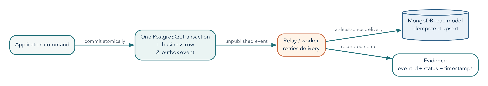

# Multiple Databases Multiply Options and Obligations

## Operating Question

If one application uses PostgreSQL and MongoDB, which system owns each fact, how do
changes cross the boundary, and how can an incident be diagnosed without making
the systems disagree further?

## Learning Outcomes

After this module, you can:

- distinguish polyglot persistence from casual technology accumulation;
- assign one authoritative owner to each fact;
- compare synchronous dual writes, event-driven propagation, and reconciliation;
- identify consistency, security, backup, and observability obligations across
  systems;
- triage a cross-database incident from symptoms, logs, and stored records; and
- defend a one-platform or two-platform final-project choice.

## Polyglot Persistence Is Workload-Based Specialization

Two screens can disagree even when both databases are healthy. The staff screen
may read the authoritative ticket row while the resident screen reads a copy
maintained elsewhere. This chapter follows one change between those screens.
The new skill is recognizing a boundary between systems, not building a large
distributed application from scratch.

A polyglot system uses different data technologies for different responsibilities.
For example:

- PostgreSQL owns users, permissions, and authoritative ticket state;
- MongoDB stores flexible, high-volume event detail or read-optimized ticket
  snapshots; and
- an object store holds attachments.

This can fit workloads well. It also creates more deployment, access, monitoring,
recovery, and consistency work. A small application should prefer one database
unless the second solves a specific problem worth that cost.

## Every Fact Needs One Authoritative Owner

If both PostgreSQL and MongoDB contain `ticket.status`, answer:

- Which copy accepts the business update?
- Which copy is derived?
- How is the derived copy refreshed?
- How stale may it be?
- How is disagreement detected and repaired?
- Which copy is used during recovery?

Without an owner, "synchronize both" becomes an undefined circular obligation.
Duplication can be deliberate when one source is authoritative and the other is a
cache, projection, snapshot, or historical record.

An **authoritative** record is the record whose accepted update establishes the
current business fact. A **projection** is a derived representation arranged for
a particular read. A **snapshot** intentionally preserves a state at a named
earlier time. These are different promises. A snapshot from February is not
incorrect merely because today's authoritative value has changed; a projection
advertised as current may be incorrect if it silently remains at February's state.

Ownership can differ by fact. PostgreSQL might own ticket status while an object
store owns the attachment bytes. "PostgreSQL is the source of truth" is too broad
if it implies the attachment can be reconstructed from a filename alone. State
which fact and which accepted update you mean.

## Synchronous Dual Writes Create Partial-Failure Risk

Naive sequence:

1. update PostgreSQL;
2. update MongoDB; and
3. return success.

If step 1 commits and step 2 fails, the stores disagree. Reversing the order only
changes which partial outcome occurs. A distributed transaction protocol can
coordinate some systems but adds availability, latency, and operational cost and
is not generally supplied by two unrelated cloud APIs.

Do not hide the boundary behind a broad `try/except`. Record an operation ID,
preserve an authoritative result, and design retry or reconciliation.

An exception handler sees what the client observed, not necessarily what a
remote service committed. If MongoDB stored the projection but its response was
lost, retrying can apply the change twice unless the operation is designed for
that possibility. Returning an error to the browser also does not roll back a
PostgreSQL transaction that has already committed. A transaction boundary inside
one database is not a transaction boundary around arbitrary network calls.

## Event-Driven Propagation Separates Commit From Projection

One pattern:

1. begin one PostgreSQL transaction;
2. update the authoritative record and insert its outgoing event in that same
   transaction;
3. commit both, or roll both back;
4. after commit, a relay delivers the recorded event to a consumer;
5. the consumer applies it to the MongoDB projection; and
6. monitoring identifies undelivered work, failed application, or excessive lag.

The **transactional outbox** stores the business change and outgoing event in the
same local transaction. A relay publishes unsent events. This avoids the gap where
the business row commits but the event is never recorded.

An **event** is a record describing a particular change. The **relay** moves that
record from the outbox to its delivery channel. The **consumer** reads delivered
events and applies the intended effect. Those names identify responsibilities;
they do not require three separate products in a small application.

Suppose the relay sends an event successfully but stops before recording that it
was sent. On restart it can send the event again. Alternatively, a consumer can
apply the change and lose its acknowledgment. A design that allows redelivery
can recover from those gaps, provided repeated application is safe. Recording an
event in the same transaction closes the original missing-event gap; it does not
magically establish exactly-once effects across all later systems.

The consumer should be idempotent: applying the same event twice should not create
duplicate effect. Use stable event IDs and record processed state or use an upsert
whose final state is deterministic.

For a transformation $f_e$ applying event $e$ to state $x$, idempotency means:

$$
f_e(f_e(x))=f_e(x).
$$

Setting a status to a particular value can have that property. Adding one to a
counter does not: applying the same increment twice changes the result twice.
Even an idempotent status update can be wrong when it arrives out of order.
Setting a ticket to an older `open` state twice is repeat-safe, but still wrong
after a newer `resolved` state. Repetition and ordering require distinct reasoning.

Event-driven design trades immediate cross-store consistency for decoupling,
retries, and observable lag. State whether that is acceptable to the user.

### Try the Ordering Rule Without Cloud Infrastructure

The example below is an executable model of one projection. A **version** is a
counter assigned in the authoritative order for this ticket, not the consumer's
clock time. Each event carries the complete projected status at that version.
Python dictionaries stand in for stored records; no database connection is made.

```python
projection = {"ticket_id": 1008, "status": "open", "source_version": 16}
deliveries = [
    {"status": "resolved", "source_version": 17},
    {"status": "resolved", "source_version": 17},
    {"status": "closed", "source_version": 18},
    {"status": "open", "source_version": 16},
]

for event in deliveries:
    if event["source_version"] > projection["source_version"]:
        projection["status"] = event["status"]
        projection["source_version"] = event["source_version"]
    print(projection["status"], projection["source_version"])
```

The observed states should be `resolved 17`, `resolved 17`, `closed 18`, and
`closed 18`. The duplicate changes nothing, and the late version 16 cannot move
the projection backward. The in-class lab lets students remove that condition
and observe the regression directly.

This works for the stated full-state events. If version 17 means "add one" and
version 18 means "add two," applying only version 18 loses the earlier increment.
Delta events need ordering, deduplication, or a state-reconstruction strategy
appropriate to their meaning. A version number does not make arbitrary skipped
operations safe.

The loop also assumes one consumer acts at a time. Two independent production
consumers must not separately read an old version and then blindly write their
own answers. For an existing MongoDB projection, an expected-version filter and
update can compare and change the same document atomically. A missing projection
needs a separate initialization policy. A zero-match result can mean "already
newer" or "not present," so those cases need to be distinguished.

{#fig-polyglot-outbox width=96%}

## Reconciliation Is a Designed Operation

Even a reliable pipeline needs a way to compare systems.

Useful checks include:

- counts by stable partition or date;
- missing authoritative identifiers;
- version or updated-at mismatches;
- hashes of canonical field sets;
- event offsets or last processed IDs; and
- samples of high-risk records.

Reconciliation output should identify an owner and repair direction. Blindly
copying the newest timestamp can be wrong when clocks, delayed events, or manual
repairs differ.

**Lag** is the gap between authoritative progress and applied projection progress.
An empty queue does not necessarily prove a correct projection if failed messages
were discarded. Counts can agree while field values differ, just as equal totals
hid the array-counting mistake in Chapter 11. Compare stable identifiers and
versions for the affected records, then broaden the check to the scope suggested
by the failure.

## Identity and Access Cross the Boundary Too

A shared application user may map to:

- a Supabase Auth identity;
- PostgreSQL roles or RLS claims;
- an application service credential;
- an Atlas database user; and
- document-level owner identifiers.

Do not give browser clients powerful Atlas or Supabase service credentials. A
backend service can mediate access, but it must enforce authorization and retain
least privilege in both databases.

Audit records should correlate actions through a request or operation ID without
copying secrets or unnecessary personal data.

## Backup and Restore Need an Order

Independent logical dumps taken at different moments may not represent one
application-consistent point. A recovery plan must state:

- which system is authoritative;
- backup cadence and recovery point for each;
- restore order;
- how derived data is rebuilt or reconciled;
- how events are replayed without duplication; and
- how traffic remains isolated until verification.

If MongoDB contains a rebuildable projection of PostgreSQL facts, restoring
PostgreSQL and regenerating the projection may be safer than treating both dumps
as equally authoritative.

## Worked Incident: Ticket State Disagrees

**Symptoms:** The resident portal shows ticket 1008 as `open`. The staff dashboard
shows `resolved`. The event feed contains a `ticket_resolved` event.

**Architecture:** PostgreSQL owns ticket state. An outbox relay updates a MongoDB
read projection used by the resident portal.

### Incident Trace

1. Query PostgreSQL ticket 1008 and its transaction/update time.
2. Query the outbox for the stable event ID and publish status.
3. Query consumer logs or checkpoint for that event ID.
4. Query the MongoDB projection's source version and event ID.
5. Check whether later events supersede it.

### Plausible Finding

PostgreSQL and the outbox committed. The consumer failed after receiving the event
but before updating the projection, and its retry queue is paused.

In the assigned incident, the later MongoDB read still shows version 16 while
the authoritative row and its event are version 17. The consumer recorded a
timeout and then paused because its database credential expired. The timeout by
itself is ambiguous; the later record comparison establishes that this particular
projection is still behind. The first repair concerns the consumer's approved
access and retry path, not reverting the correct authoritative ticket to match
the stale page.

### Response

Resume or replay the idempotent consumer from the recorded event. Do not manually
edit both stores without recording the repair. Verify the MongoDB projection now
contains the authoritative version, the event is marked processed, lag returns to
normal, and no duplicate history was created.

### Limitation

These observations support one incident path. They do not show that every projection is
consistent; run the reconciliation check for the affected partition.

A useful update to a colleague would be: "The resident page is behind the staff
record because the projection consumer is not progressing. Ticket 1008 is at
authoritative version 17, while the inspected projection remains at 16. Restore
the consumer's approved access, resume safe delivery, and verify version 17 or a
newer authoritative state. Then inspect the other queued tickets before closing
the incident." This explanation separates observed facts from the proposed
repair; it does not claim the repair was completed before checking it.

## Observability Should Follow a Request Across Systems

Useful signals include:

- request or operation ID;
- authoritative commit result;
- outbox backlog and oldest age;
- consumer success/failure and retry count;
- projection version lag;
- query latency and error by datastore;
- connection-pool exhaustion; and
- backup age and last restore verification.

Logs without stable identifiers make cross-system timelines guesswork. Metrics
without user impact can also mislead. Connect technical observations to the failed
operation.

## A One-Database Design Is Often the Stronger Decision

Use one platform when:

- the workload fits its model and scale;
- the team is small;
- cross-store consistency would add risk;
- operational records are already difficult to correlate; or
- the second system is chosen only to appear advanced.

Use two when the workload benefit is concrete, ownership is explicit, propagation
and recovery are designed, and the team can operate both.

## Common Misconceptions

### "The same ID means the records are synchronized"

Identifiers support correlation. They do not prove field equality, ordering, or
successful propagation.

### "Events guarantee consistency"

Events create a mechanism. Delivery, ordering, idempotency, retries, lag, and
reconciliation determine behavior.

### "Two backups produce one consistent recovery point"

Independent artifacts can represent different moments. Ownership and replay order
must be part of the plan.

### "Polyglot means using as many databases as possible"

It means matching technologies to distinct needs while accepting the operating
cost.

## Study and Practice

Before Day 1, read through the worked incident, including the event-driven example
and reconciliation discussion. Before Day 2, review access, recovery, and the
one-platform versus two-platform decision for the project clinic. The weekly
lab combines the supplied incident with the small Python experiment in one
Brightspace response. The inventory responsibility table below is optional
self-study, not a second report.

Create a responsibility table for a two-store inventory system. For inventory
quantity, product description, flexible event details, and user access, name the
authoritative store, derived copy if any, propagation path, acceptable staleness,
reconciliation check, and recovery order.

## Retrieval and Transfer

1. Why does each duplicated fact need one authoritative owner?
2. What partial failure occurs in synchronous dual writes?
3. How does a transactional outbox reduce one failure gap?
4. What makes an event consumer idempotent?
5. Why can two independent backups be application-inconsistent?
6. Which logs and checks would diagnose projection lag?

## Further Reading

- [Martin Fowler, Polyglot Persistence](https://martinfowler.com/bliki/PolyglotPersistence.html)
- [Microsoft Azure Architecture Center, Transactional Outbox pattern](https://learn.microsoft.com/azure/architecture/databases/guide/transactional-outbox-cosmos)
- [AWS Prescriptive Guidance, Transactional Outbox pattern](https://docs.aws.amazon.com/prescriptive-guidance/latest/cloud-design-patterns/transactional-outbox.html)
- [PostgreSQL logical decoding concepts](https://www.postgresql.org/docs/current/logicaldecoding-explanation.html)
- [MongoDB change streams](https://www.mongodb.com/docs/manual/changeStreams/)
