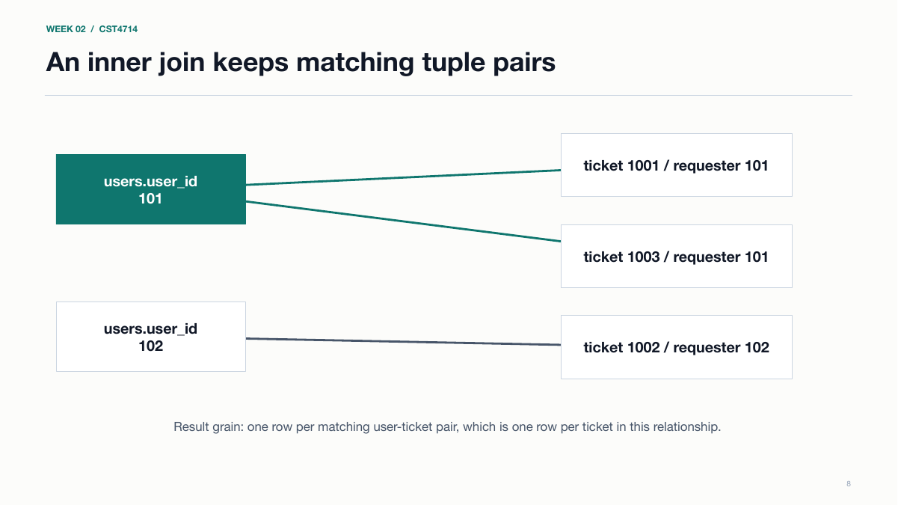
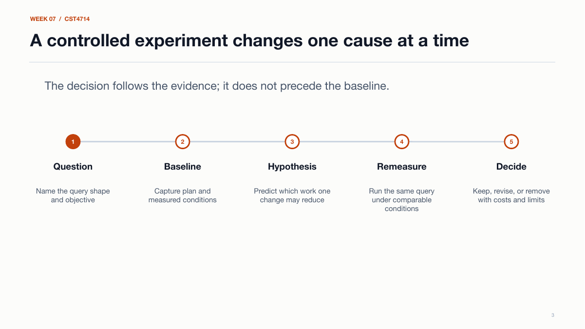
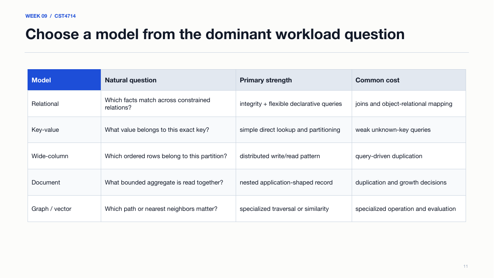
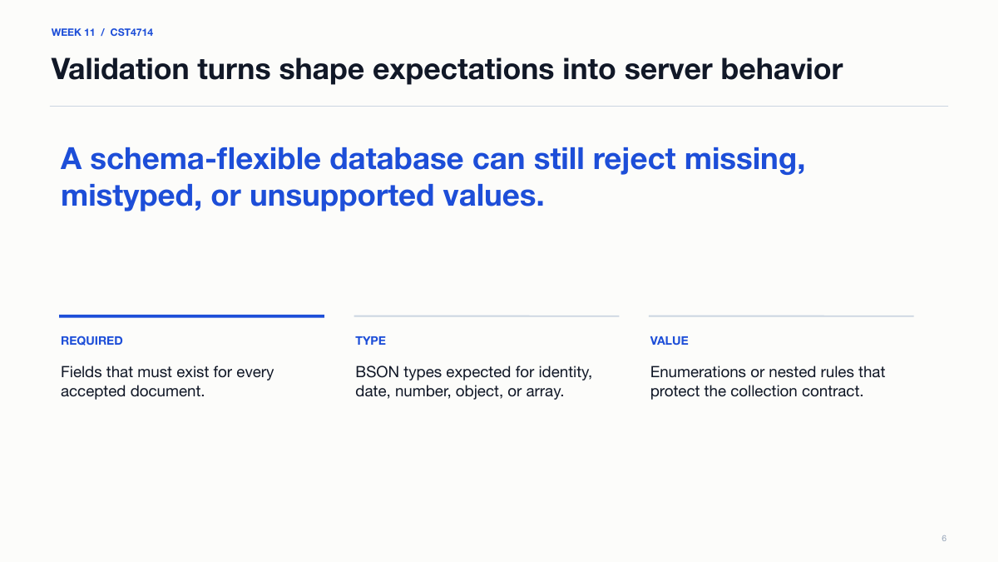
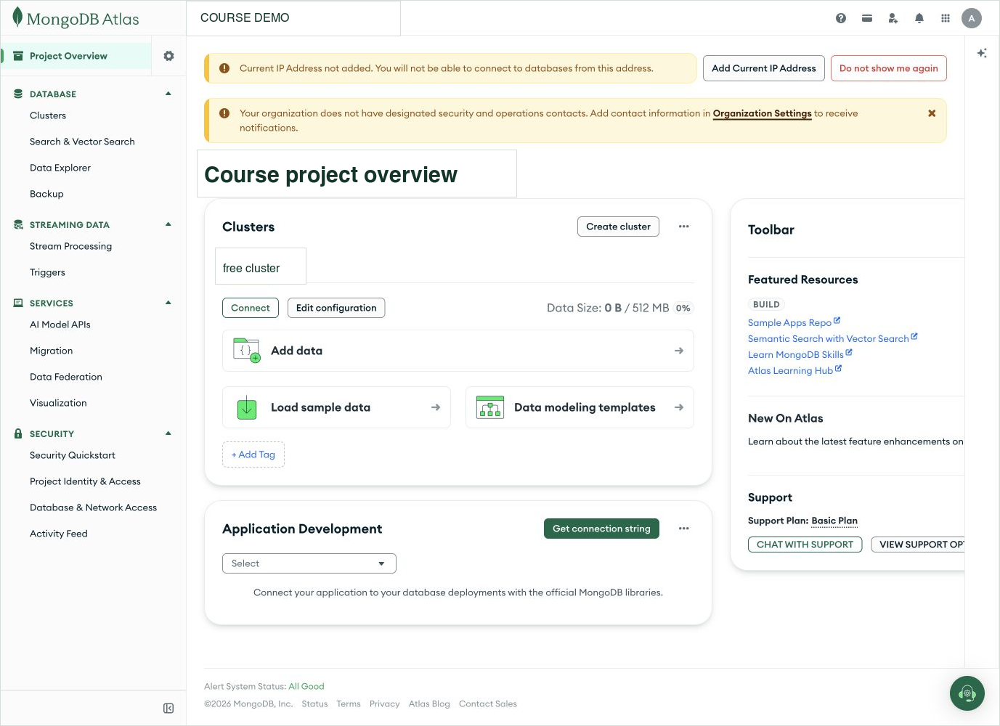
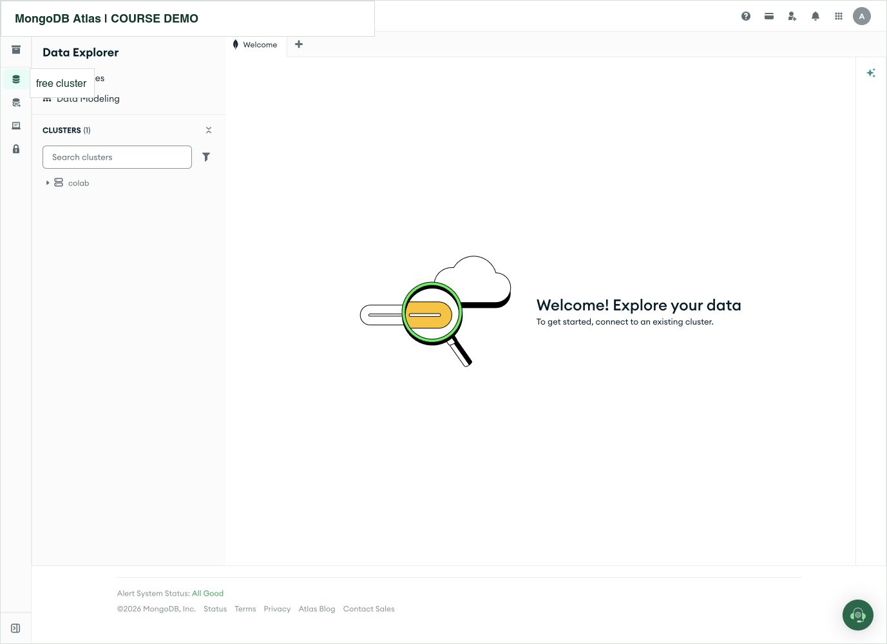
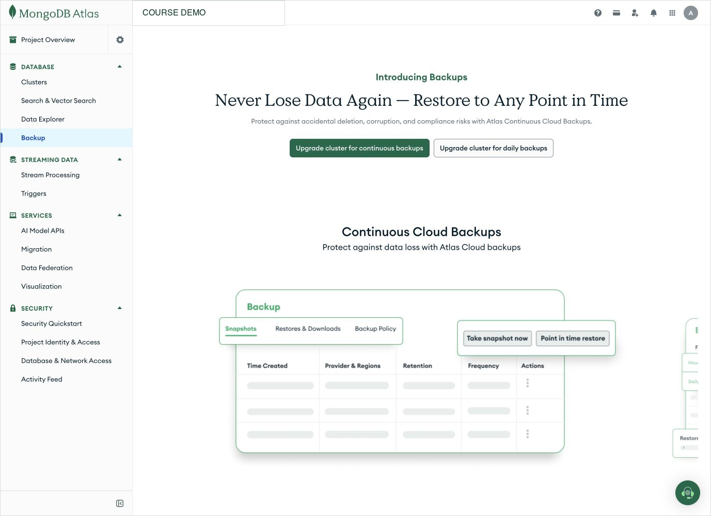
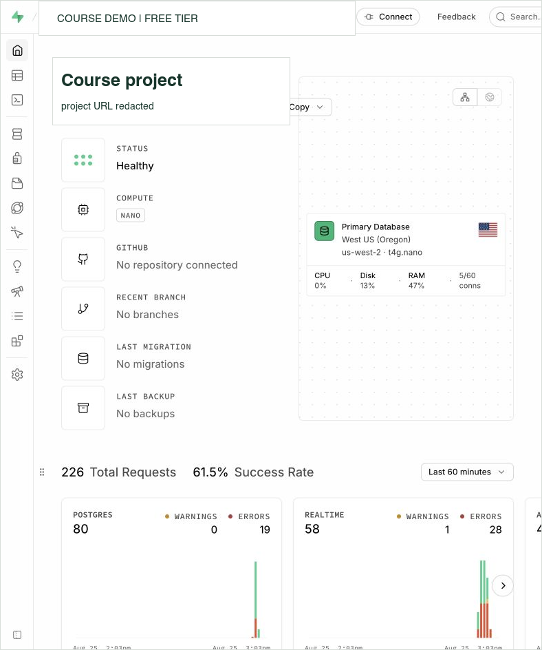
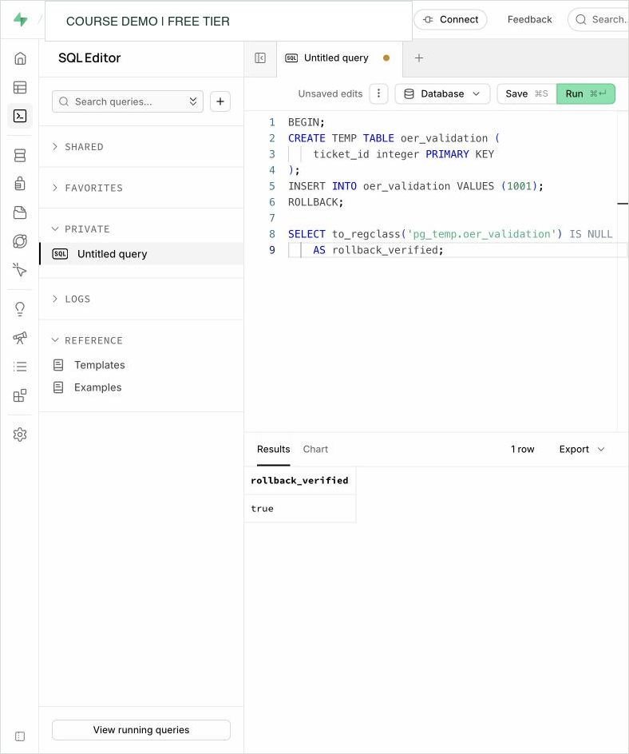

# Visual Showcase: Operating Cloud Databases

This short gallery is the recommended visual route through the fellowship
project. It demonstrates the size, coherence, technical depth, and currentness of
the work without requiring a reviewer to browse the repository. The complete
inventory remains in the [OER catalog](../../course/OER_CATALOG.md).

## How to Use This Page

Show the first four images to explain the authored learning progression. Show
the final six to explain how current cloud interfaces were investigated,
redacted, interpreted, and converted into durable instruction. The interface
screenshots are evidence used inside original explanations; the vendor interface
itself is not claimed as authored OER.

## 1. Relational Reasoning Comes Before Memorized SQL

**What this demonstrates:** the course does not assume that students remember
SQL. It rebuilds tuple, attribute, key, selection, projection, Cartesian product,
theta join, and result-grain reasoning before administration tasks depend on
those ideas. The second-edition text uses conventional symbols such as
$\sigma$, $\pi$, $\rho$, $\times$, and $\bowtie$ and then translates them into
SQL.

**Authorship boundary:** the explanation, diagram, sequence, slide, exact speaker
script, practice task, and Metro Support examples are course-authored OER.

## 2. Performance Is Taught as a Controlled Experiment

**What this demonstrates:** students do not learn that an index is a magic
speed button. They state the workload, capture a baseline plan, change one
variable, rerun the same query, compare rows and plan evidence, and discuss the
write, storage, and maintenance cost. This evidence cycle recurs throughout the
textbook, labs, notebooks, and projects.

**Authorship boundary:** the controlled-experiment framework, fixture, lab,
visual, and interpretation prompts are course-authored OER. PostgreSQL itself
and its documentation are not.

## 3. NoSQL Begins With Workload Choice, Not Product Advocacy

**What this demonstrates:** the course explains the evolution and historical
meanings of NoSQL, then introduces key-value, wide-column, document, graph, and
vector systems through the questions they make direct. Students also learn basic
graph notation and cosine similarity rather than seeing graph and vector
databases as unexplained product categories.

**Authorship boundary:** the synthesis, decision visual, JSON alternatives,
graph/vector explanations, and student activities are course-authored OER.
Linked historical papers and vendor documentation remain attributed sources.

## 4. MongoDB Operations Connect Modeling, Rules, and Evidence

**What this demonstrates:** MQL is not isolated syntax practice. Students connect
document shape to access patterns, aggregation grain, schema validation,
compound indexes, and `explain("executionStats")` evidence. The live instructor
activity and assigned individual MongoDB University lab are deliberately
different.

**Authorship boundary:** the course explanation, worked examples, assignment
wrapper, fallback, and evidence requirements are OER. MongoDB University and
MongoDB-supplied educator presentations remain free vendor materials in
[free external resource catalog](../../course/external_resources/INDEX.md).

## 5. Atlas Demonstrates Shared Responsibility

**What students learn:** service health and connection readiness are different
facts. Atlas can operate the deployment while the customer still owns network
access, database identity, data loading, modeling, query behavior, and recovery
evidence. The screenshot was captured from a free course project on August 25,
2026 and redacted before inclusion.

## 6. Data Explorer Still Has Connection Prerequisites

**What students learn:** a visible database tool is not proof that the client is
authorized, that a database user exists, or that an application can connect.
Students diagnose service, network, TLS, identity, authorization, and object
layers separately instead of weakening certificate validation or guessing.

## 7. Free-Tier Plan Limits Change the Recovery Design

**What students learn:** a backup menu is not evidence that a recoverable
artifact exists. The course records the plan boundary, teaches a logical
`mongodump`/`mongorestore` path, requires a separate restore target, and asks for
structure, data, behavior, and limitation evidence.

## 8. Supabase Makes Managed PostgreSQL Observable

**What students learn:** a healthy managed service does not prove schema quality,
query correctness, authorization, or recoverability. The visible lack of backups
becomes an operating constraint to document, not a reason to invent coverage the
free plan does not provide.

## 9. An Empty Table Editor Is a Schema Question

**What students learn:** the dashboard distinguishes a project, database,
schema, table, and row. Starting from an empty schema supports deliberate table,
key, relationship, constraint, and access-policy decisions rather than treating
the interface as the model.

## 10. A Reversible Test Produces Better Evidence Than a Success Banner

**What students learn:** the live smoke test used a temporary table inside an
explicit transaction and verified that rollback removed it. The result teaches
transaction boundaries, expected state, verification, and cleanup without
leaving persistent course data. A generic `Success` message would be weaker
evidence.

## What the Full Package Adds Beyond These Images

The gallery represents, but does not replace, the complete system: 15 textbook
chapters, 15 two-class weekly guides, 25 individual labs, six notebooks, three
data packages, 15 fully scripted student decks, assessments, two major projects,
instructor adoption guidance, accessibility and currentness records, and a
reproducible Word/PDF/HTML/EPUB publication pipeline.

The current second-edition draft is 119 pages and contains 106 numbered code
listings, 142 MathML equations, editable diagrams, a notation glossary, evidence
templates, and dated/redacted cloud-interface figures. It remains an unpublished
draft pending review, classroom use, revision, approval, and authorized release.
